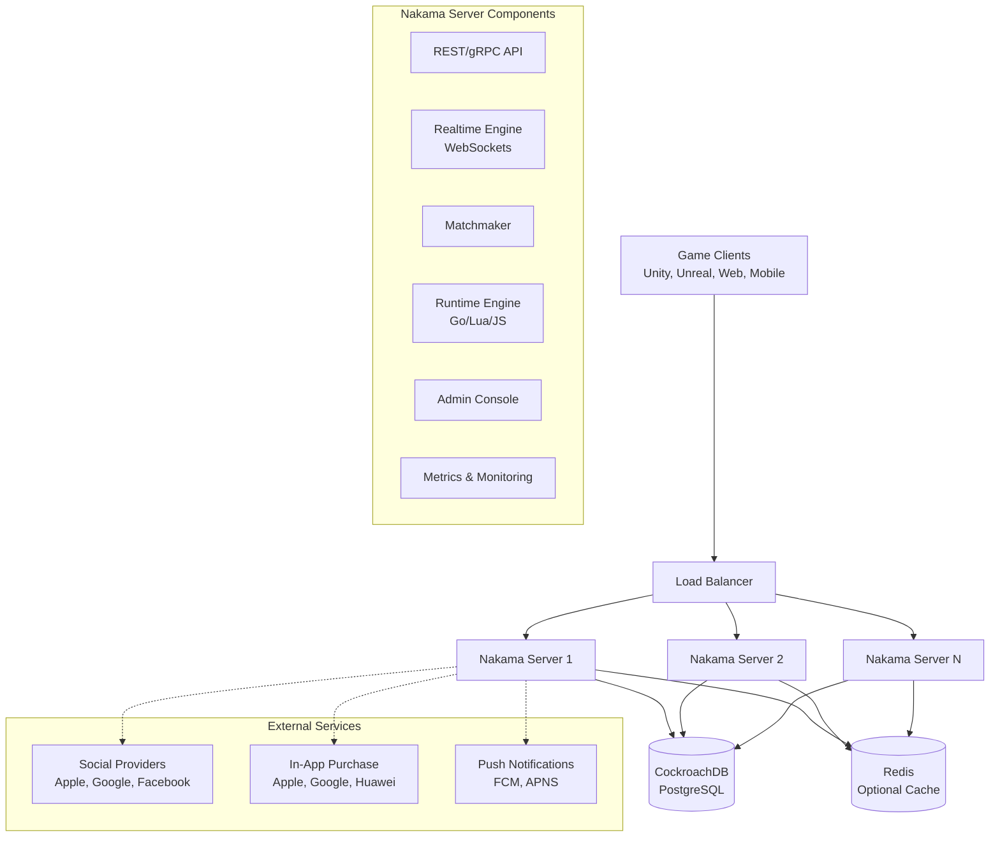
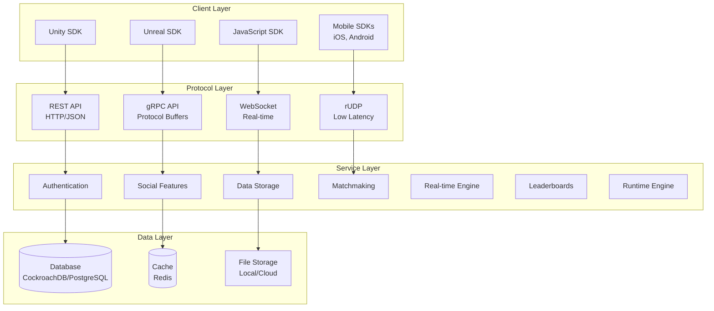
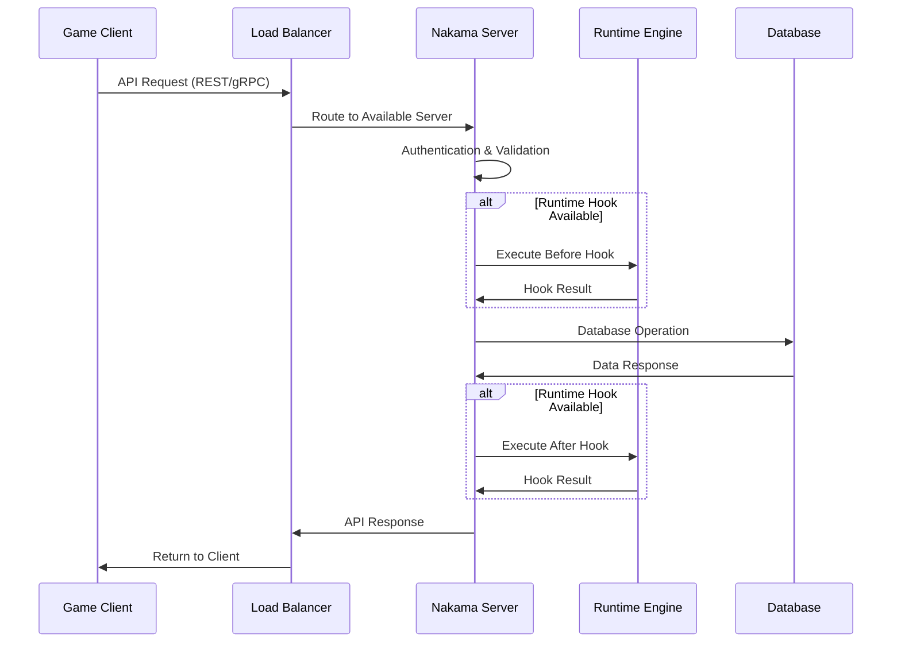
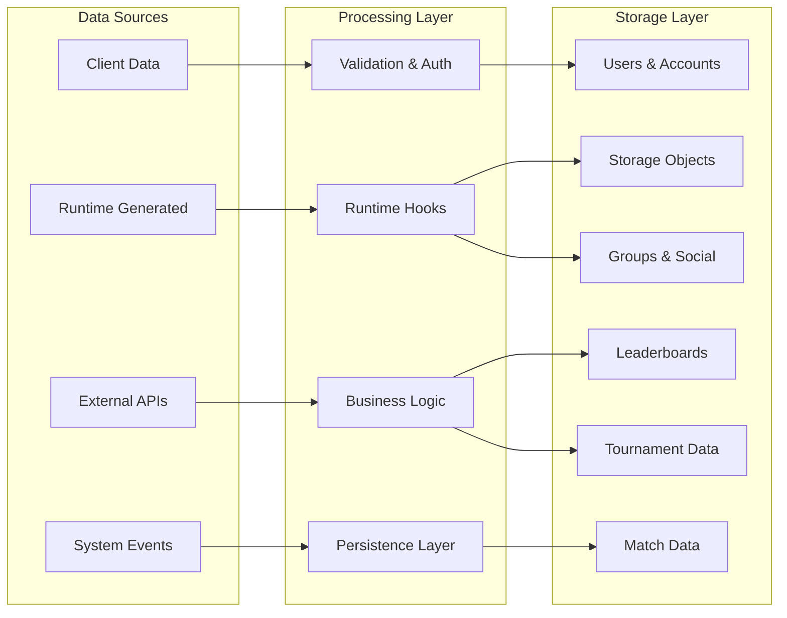
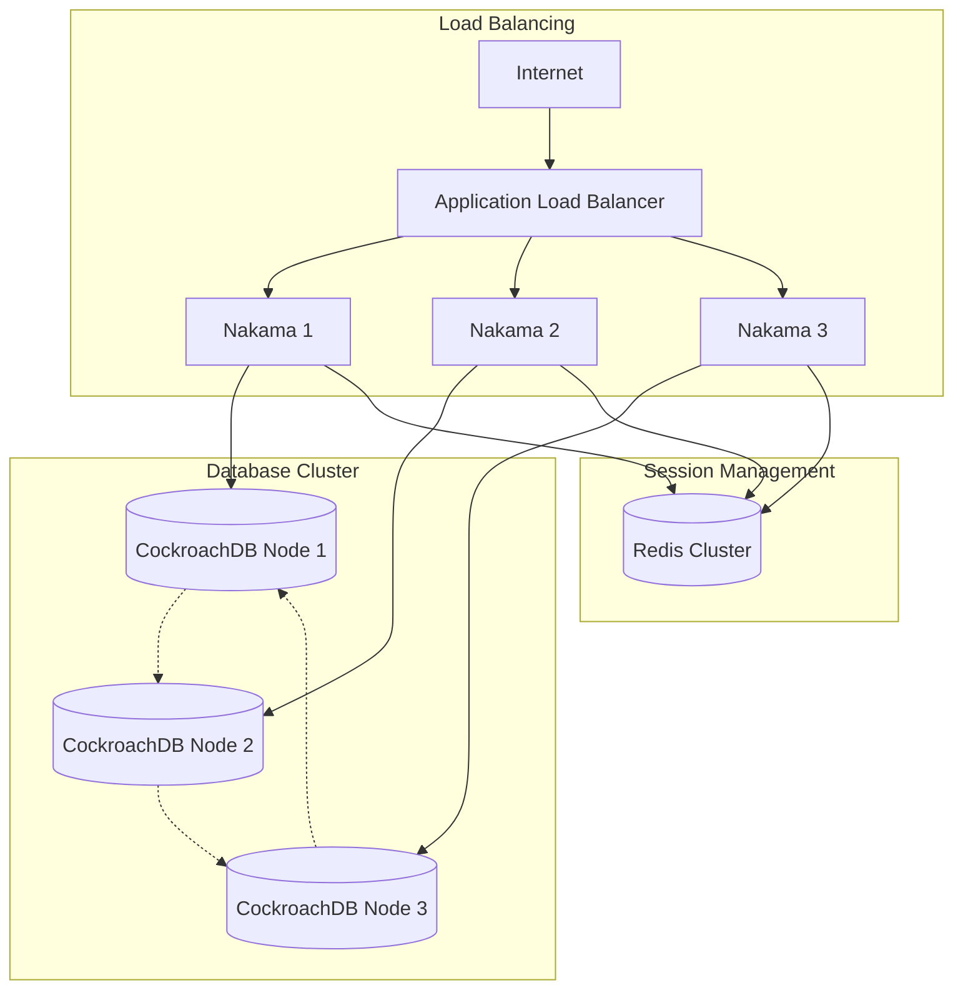
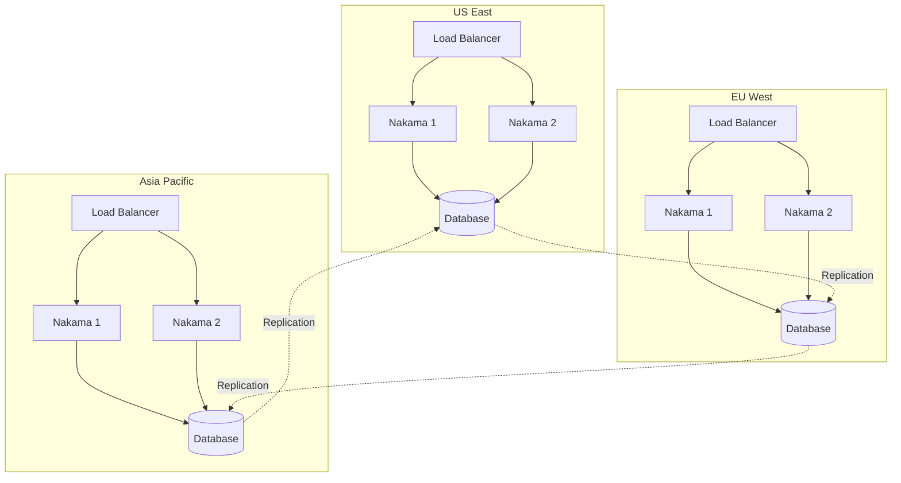

# Nakama Architecture Overview

Nakama is a distributed, scalable server for social and realtime games and apps. This document provides a comprehensive overview of the system architecture, core components, and design principles.

## High-Level Architecture

## Core Design Principles

### 1. Horizontal Scalability
- **Stateless Servers**: Nakama servers are designed to be stateless, allowing horizontal scaling
- **Shared Database**: All servers share a common database for persistent state
- **Session Affinity**: Real-time connections maintain session affinity for optimal performance

### 2. Multi-Protocol Support
- **REST API**: HTTP/1.1 with JSON for web clients and traditional request/response patterns
- **gRPC**: High-performance binary protocol for mobile and native clients
- **WebSockets**: Real-time bidirectional communication for live features
- **rUDP**: Optimized UDP protocol for low-latency gaming scenarios

### 3. Extensibility
- **Runtime Hooks**: Extend server logic with custom code in Go, Lua, or JavaScript
- **Plugin Architecture**: Modular design allows custom integrations
- **Event System**: React to game events with custom logic

## System Layers

## Request Flow Architecture

## Data Flow Architecture

## Key Components Overview

### Authentication & Authorization
- JWT-based session management
- Multi-provider social authentication
- Device-based authentication
- Role-based access control

### Real-time Engine
- WebSocket connection management
- Match-based communication
- Party and group chat
- Live event broadcasting

### Storage Engine
- User-scoped data storage
- Global shared storage
- Conditional writes and transactions
- Storage indexing and queries

### Matchmaking System
- Skill-based matching
- Custom matching criteria
- Real-time and turn-based support
- Authoritative server architecture

### Social Features
- Friend relationships
- Groups and guilds
- Chat systems
- Activity feeds

### Runtime Engine
- Pluggable server-side logic
- Multi-language support (Go, Lua, JavaScript)
- Event-driven architecture
- Custom RPC endpoints

## Scalability Patterns

### Horizontal Scaling

### Geographic Distribution

## Performance Characteristics

- **Throughput**: Handles thousands of concurrent connections per server
- **Latency**: Sub-100ms response times for real-time operations
- **Availability**: 99.9%+ uptime with proper clustering
- **Consistency**: Strong consistency for critical game state
- **Partition Tolerance**: Graceful degradation during network issues

## Security Architecture

- **Transport Security**: TLS encryption for all communications
- **Authentication**: Multi-factor authentication support
- **Authorization**: Fine-grained permission system
- **Data Protection**: Encryption at rest and in transit
- **Rate Limiting**: Protection against abuse and DDoS
- **Audit Logging**: Comprehensive security event logging

## Technology Stack

- **Language**: Go (primary server), Lua/JavaScript (runtime)
- **Database**: CockroachDB (primary), PostgreSQL (compatible)
- **Cache**: Redis (optional)
- **Protocols**: HTTP/1.1, HTTP/2, WebSockets, gRPC
- **Serialization**: JSON, Protocol Buffers
- **Monitoring**: Prometheus metrics, structured logging

## Next Steps

For detailed information about specific components:

- [Component Architecture](components.md) - Deep dive into each component
- [Database Architecture](database.md) - Schema design and data modeling
- [Authentication & Authorization](auth.md) - Security implementation details
- [Real-time Communication](realtime.md) - WebSocket and real-time features
- [Runtime Extensions](runtime.md) - Custom server-side logic
- [Deployment Architecture](deployment.md) - Production deployment patterns
- [API Architecture](api.md) - Protocol design and implementation