# API Architecture

This document details Nakama's API design, protocol implementations, endpoint structures, and client communication patterns.

## API Overview

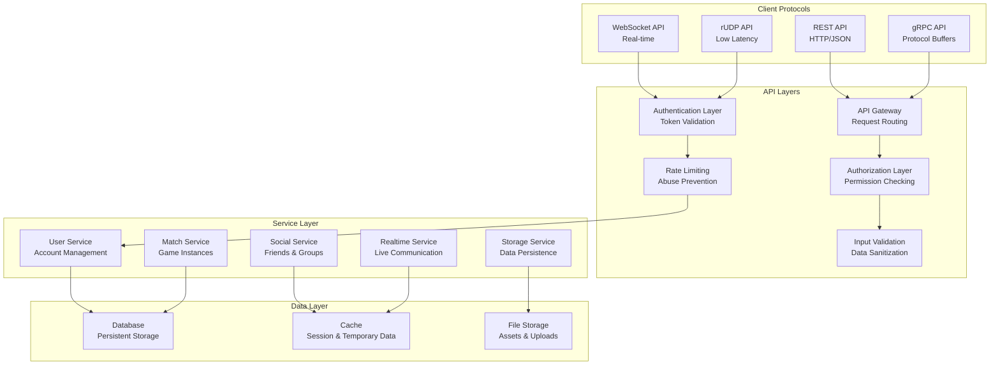

## Protocol Architecture

### 1. REST API Design

```mermaid
classDiagram
    class RESTEndpoint {
        +string method
        +string path
        +map[string]string headers
        +interface{} requestBody
        +interface{} responseBody
        +int statusCode
        +map[string]string queryParams
    }
    
    class RESTHandler {
        +HandleAuthenticate(w http.ResponseWriter, r *http.Request)
        +HandleStorageRead(w http.ResponseWriter, r *http.Request)
        +HandleStorageWrite(w http.ResponseWriter, r *http.Request)
        +HandleFriendAdd(w http.ResponseWriter, r *http.Request)
        +HandleGroupJoin(w http.ResponseWriter, r *http.Request)
        +HandleLeaderboardList(w http.ResponseWriter, r *http.Request)
        +HandleRPC(w http.ResponseWriter, r *http.Request)
    }
    
    class RESTMiddleware {
        +AuthenticationMiddleware(next http.Handler) http.Handler
        +AuthorizationMiddleware(next http.Handler) http.Handler
        +RateLimitMiddleware(next http.Handler) http.Handler
        +LoggingMiddleware(next http.Handler) http.Handler
        +CORSMiddleware(next http.Handler) http.Handler
    }
    
    RESTEndpoint --> RESTHandler : "handled_by"
    RESTHandler --> RESTMiddleware : "protected_by"
```

### 2. gRPC Service Definition

```protobuf
// Nakama API Protocol Buffer definitions
syntax = "proto3";

package nakama.api;

import "google/api/annotations.proto";
import "google/protobuf/empty.proto";
import "google/protobuf/timestamp.proto";
import "google/protobuf/wrappers.proto";
import "protoc-gen-openapiv2/options/annotations.proto";

// The Nakama RPC protocol service built with GRPC.
service Nakama {
  // Authenticate a user with a custom ID.
  rpc AuthenticateCustom (AuthenticateCustomRequest) returns (Session) {
    option (google.api.http) = {
      post: "/v2/account/authenticate/custom"
      body: "*"
    };
  }

  // Authenticate a user with a device ID.
  rpc AuthenticateDevice (AuthenticateDeviceRequest) returns (Session) {
    option (google.api.http) = {
      post: "/v2/account/authenticate/device"
      body: "*"
    };
  }

  // Read storage objects.
  rpc ReadStorageObjects (ReadStorageObjectsRequest) returns (StorageObjects) {
    option (google.api.http) = {
      post: "/v2/storage"
      body: "*"
    };
  }

  // Write storage objects.
  rpc WriteStorageObjects (WriteStorageObjectsRequest) returns (StorageObjectAcks) {
    option (google.api.http) = {
      put: "/v2/storage"
      body: "*"
    };
  }
}

// A user session.
message Session {
  // True if the corresponding account was just created, false otherwise.
  bool created = 1;
  // Authentication credentials.
  string token = 2;
  // Refresh token that can be used for session token renewal.
  string refresh_token = 3;
}

// Authenticate against the server with a custom ID.
message AuthenticateCustomRequest {
  // The custom account details.
  AccountCustom account = 1;
  // Register the account if the account does not exist.
  google.protobuf.BoolValue create = 2;
  // Set the username on the account at register. Must be unique.
  string username = 3;
}
```

### 3. WebSocket Protocol

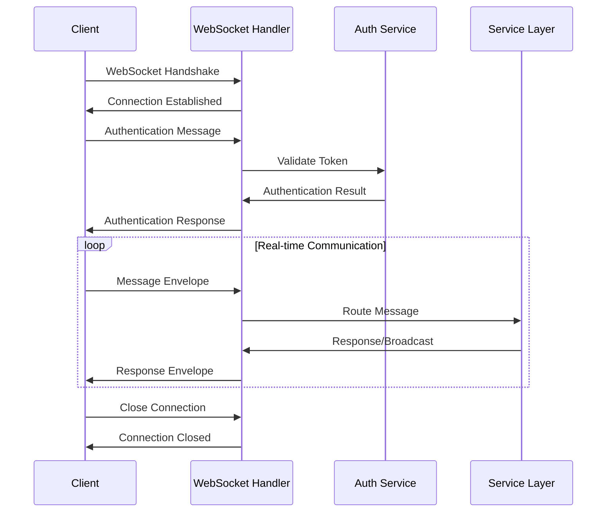

## Authentication API

### 1. Authentication Endpoints

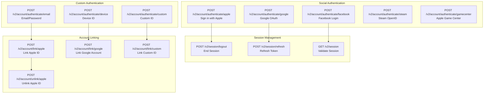

### 2. Authentication Flow

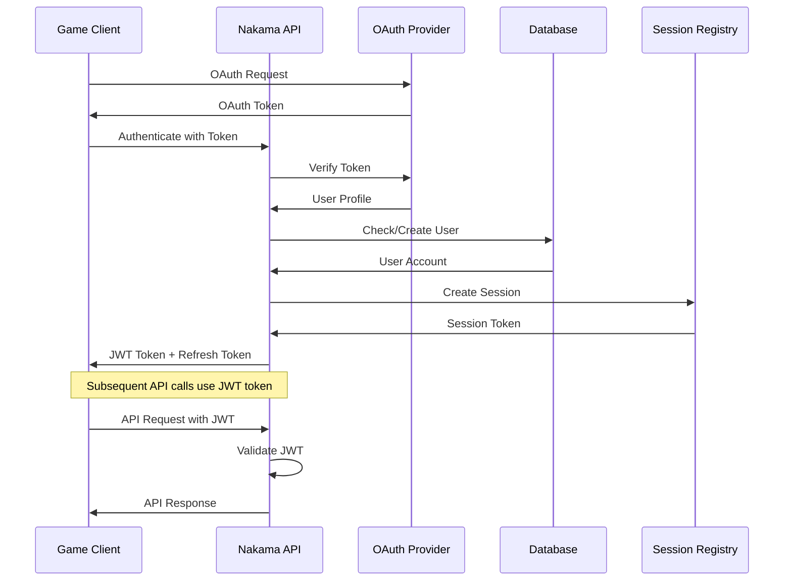

## User Management API

### 1. Account Operations

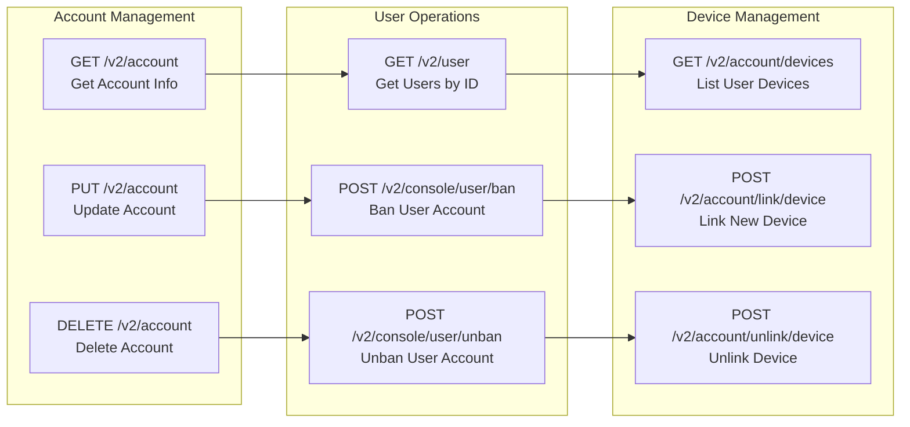

### 2. User Profile Schema

```json
{
  "user": {
    "id": "user-uuid",
    "username": "unique-username",
    "display_name": "Display Name",
    "avatar_url": "https://example.com/avatar.jpg",
    "lang_tag": "en",
    "location": "San Francisco, CA",
    "timezone": "America/Los_Angeles",
    "metadata": {
      "level": 25,
      "class": "warrior",
      "guild": "dragons"
    },
    "facebook_id": "facebook-user-id",
    "google_id": "google-user-id",
    "gamecenter_id": "gamecenter-player-id",
    "steam_id": "steam-user-id",
    "custom_id": "custom-user-id",
    "edge_count": 15,
    "create_time": "2023-01-15T10:30:00Z",
    "update_time": "2023-12-01T14:20:00Z",
    "online": true
  }
}
```

## Storage API

### 1. Storage Operations

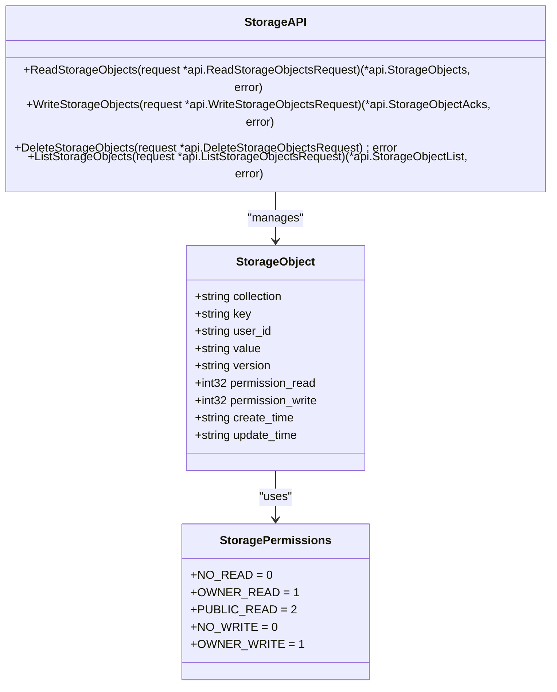

### 2. Storage Access Patterns

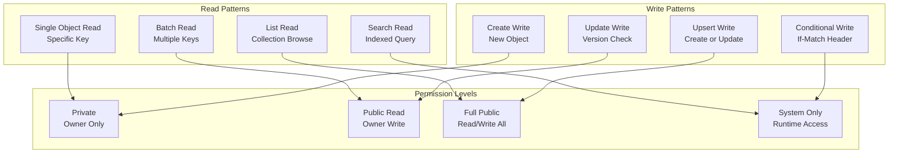

## Social API

### 1. Friends System

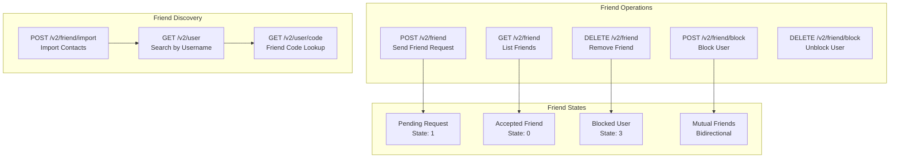

### 2. Groups System

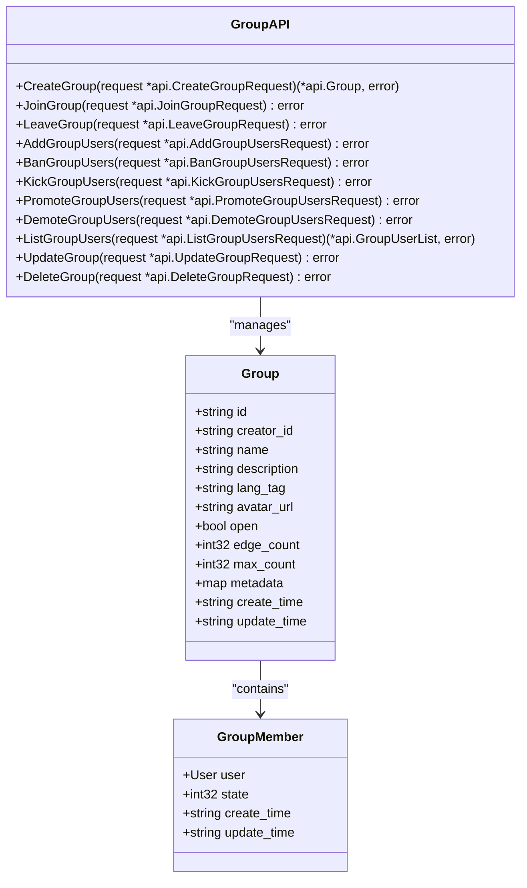

## Real-time API

### 1. WebSocket Message Types

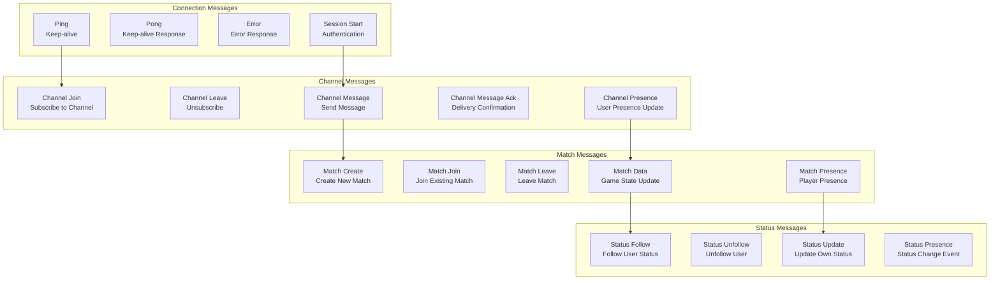

### 2. Real-time Message Flow

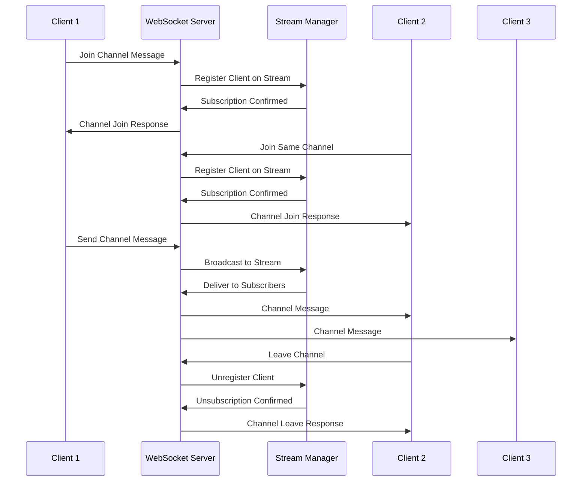

## Match API

### 1. Match Operations

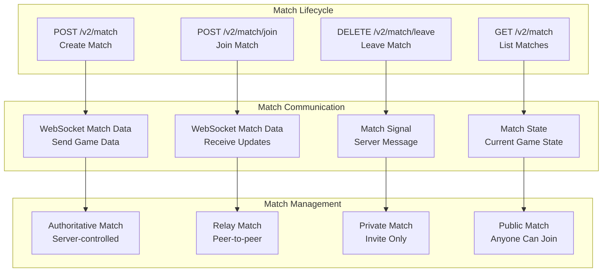

### 2. Matchmaking API

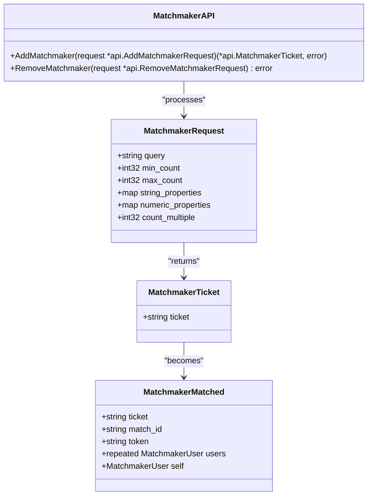

## Custom RPC API

### 1. RPC Endpoint Design

```mermaid
graph TB
    subgraph "RPC Registration"
        GoFunction[Go Function<br/>Native Implementation]
        LuaFunction[Lua Function<br/>Scripted Logic]
        JSFunction[JavaScript Function<br/>V8 Runtime]
    end
    
    subgraph "RPC Endpoints"
        HTTPEndpoint[HTTP /v2/rpc/{id}<br/>RESTful Access]
        gRPCEndpoint[gRPC Rpc Method<br/>Binary Protocol]
        WSEndpoint[WebSocket RPC<br/>Real-time Access]
    end
    
    subgraph "RPC Features"
        Authentication[Authentication Required<br/>Session Token]
        RateLimit[Rate Limiting<br/>Per User/Global]
        Validation[Input Validation<br/>Schema Checking]
        Logging[Request Logging<br/>Audit Trail]
    end
    
    GoFunction --> HTTPEndpoint
    LuaFunction --> gRPCEndpoint
    JSFunction --> WSEndpoint
    
    HTTPEndpoint --> Authentication
    gRPCEndpoint --> RateLimit
    WSEndpoint --> Validation
    
    Authentication --> Logging
    RateLimit --> Logging
    Validation --> Logging
```

### 2. RPC Implementation Pattern

```go
// Go RPC function example
func CustomGameLogic(ctx context.Context, logger runtime.Logger, db *sql.DB, nk runtime.NakamaModule, payload string) (string, error) {
    // Parse input payload
    var request struct {
        Action string `json:"action"`
        Data   map[string]interface{} `json:"data"`
    }
    if err := json.Unmarshal([]byte(payload), &request); err != nil {
        return "", runtime.NewError("Invalid JSON payload", 3)
    }
    
    // Get user context
    userID, ok := ctx.Value(runtime.RUNTIME_CTX_USER_ID).(string)
    if !ok {
        return "", runtime.NewError("User ID not found", 13)
    }
    
    // Validate user permissions
    account, err := nk.AccountGetId(ctx, userID)
    if err != nil {
        return "", runtime.NewError("Failed to get user account", 13)
    }
    
    // Custom business logic
    switch request.Action {
    case "purchase_item":
        return handleItemPurchase(ctx, logger, db, nk, account, request.Data)
    case "use_skill":
        return handleSkillUsage(ctx, logger, db, nk, account, request.Data)
    default:
        return "", runtime.NewError("Unknown action", 3)
    }
}
```

## Error Handling and Status Codes

### 1. HTTP Status Codes

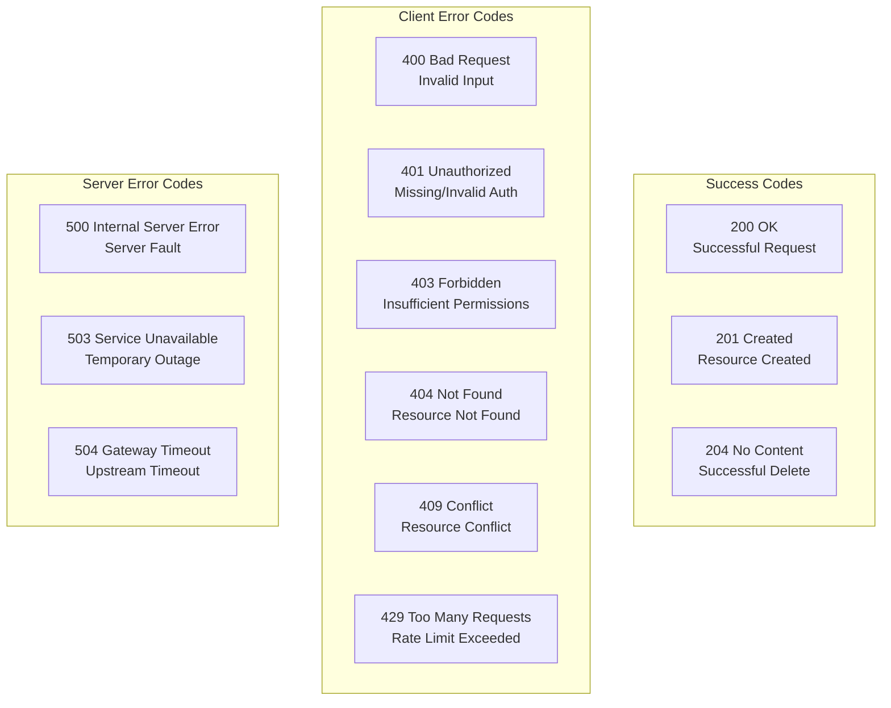

### 2. Error Response Format

```json
{
  "error": {
    "code": 3,
    "message": "Invalid argument",
    "details": [
      {
        "type": "ValidationError",
        "field": "username",
        "description": "Username must be between 3 and 20 characters"
      }
    ]
  },
  "grpc_code": 3,
  "http_code": 400,
  "message": "Invalid argument",
  "timestamp": "2023-12-01T14:30:00Z",
  "path": "/v2/account/authenticate/custom"
}
```

## API Versioning and Compatibility

### 1. Versioning Strategy

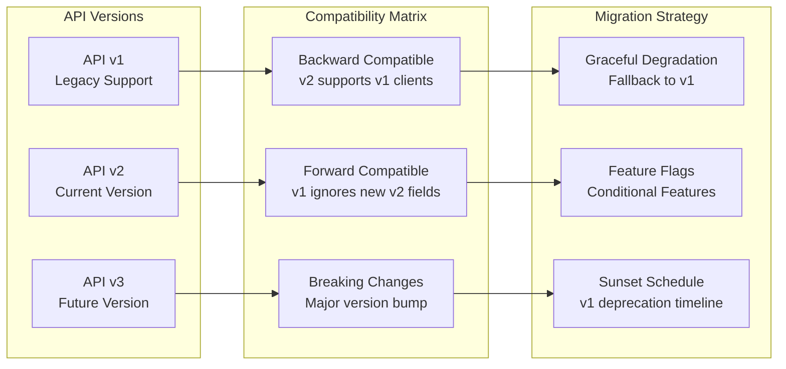

### 2. API Documentation

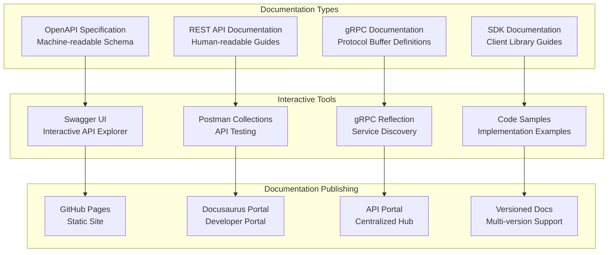

For more information on related topics:
- [Authentication & Authorization](auth.md) - API security implementation
- [Real-time Communication](realtime.md) - WebSocket API details
- [Runtime Extensions](runtime.md) - Custom RPC implementation