# Authentication & Authorization Architecture

This document details Nakama's security architecture, authentication mechanisms, and authorization patterns.

## Security Overview

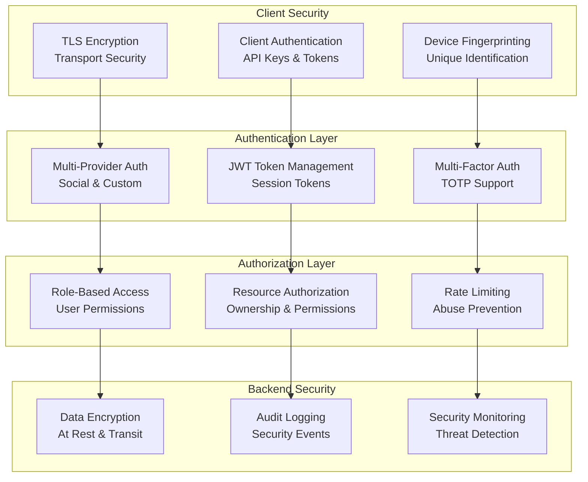

## Authentication Mechanisms

### 1. Multi-Provider Authentication

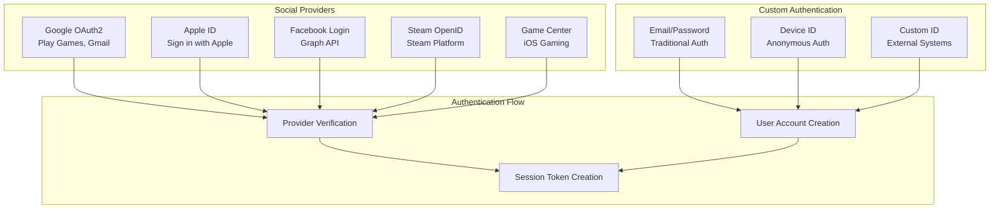

### 2. Authentication Flow Details

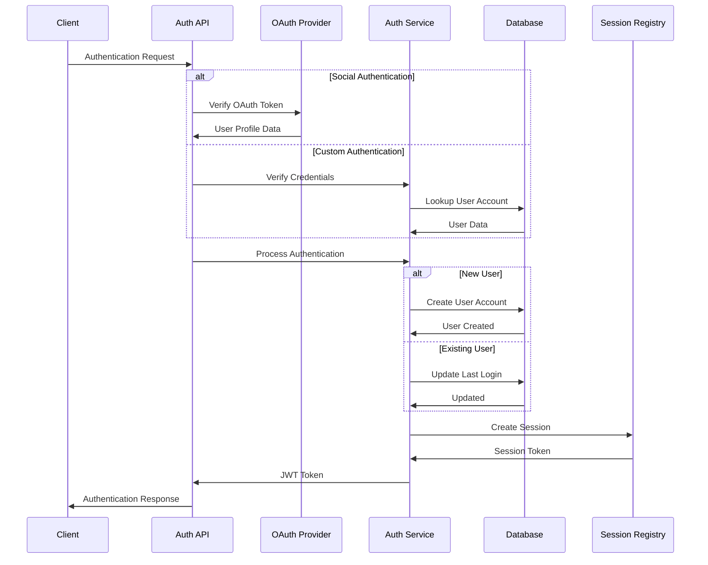

## JWT Token Architecture

### 1. Token Structure

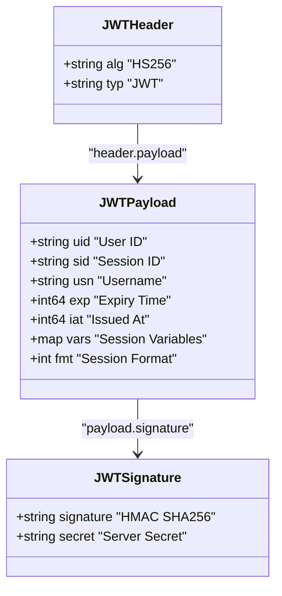

### 2. Token Lifecycle

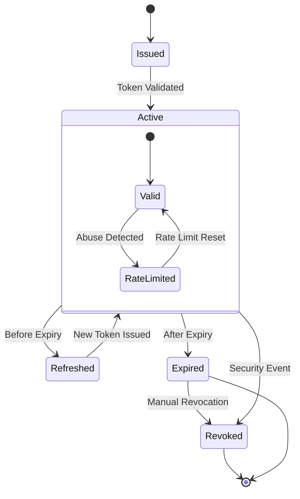

## Session Management

### 1. Session Architecture

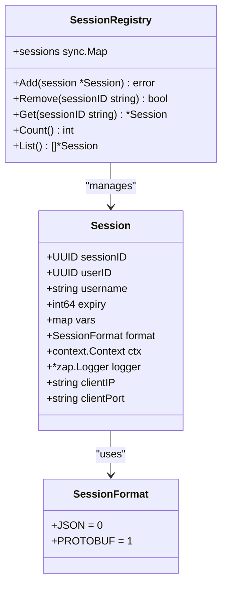

### 2. Session Security Features

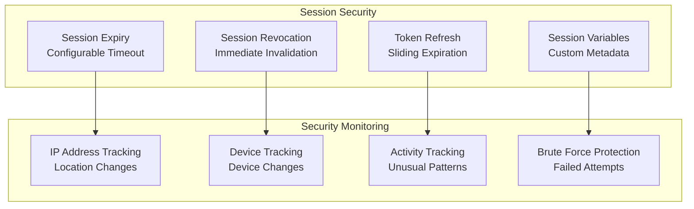

## Authorization Patterns

### 1. Resource-Based Authorization

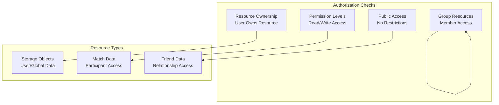

### 2. Permission Matrix

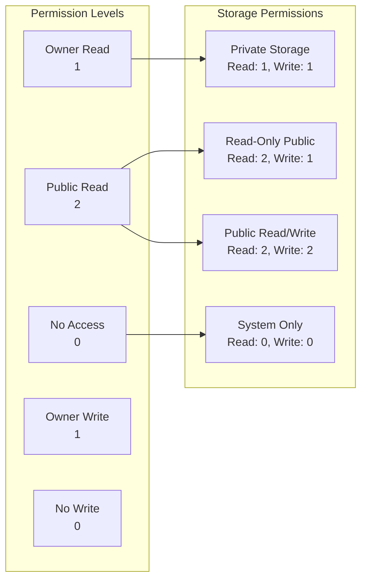

## Multi-Factor Authentication

### 1. MFA Flow

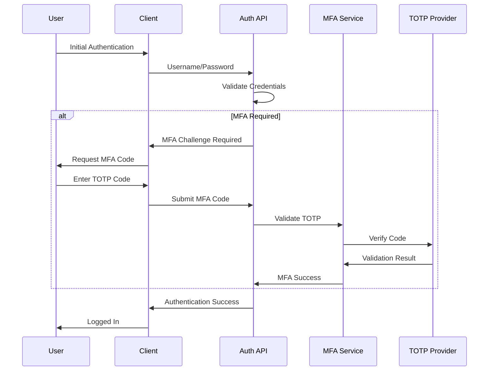

### 2. TOTP Implementation

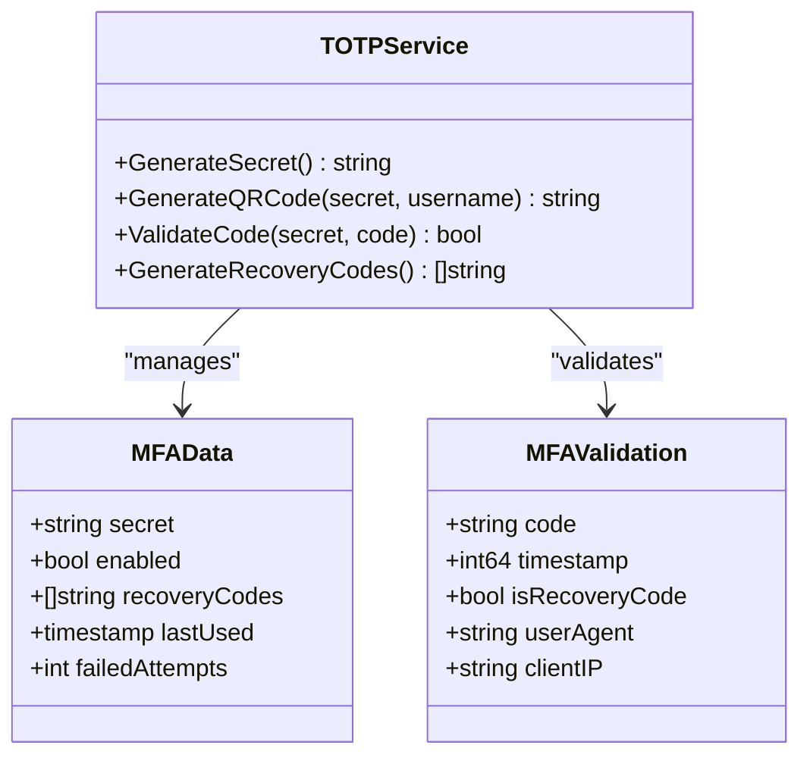

## API Security

### 1. API Authentication

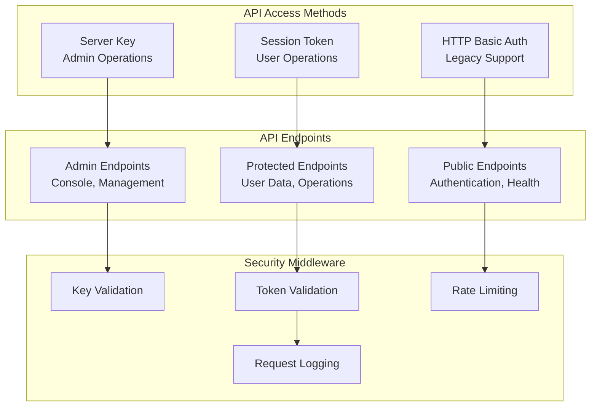

### 2. Rate Limiting Architecture

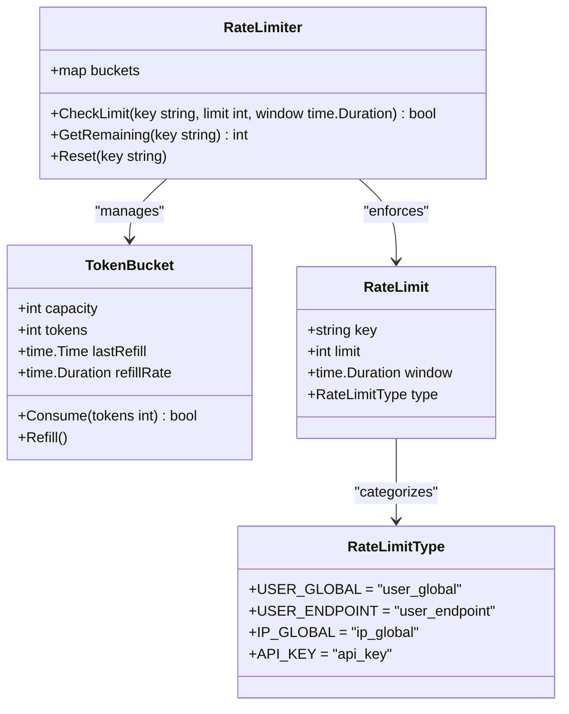

## Runtime Security

### 1. Runtime Code Isolation

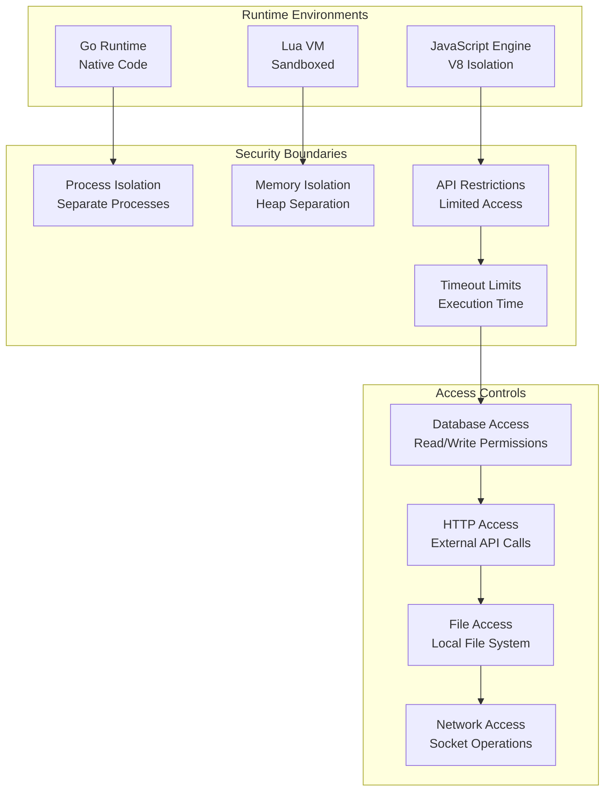

### 2. Runtime Permission Model

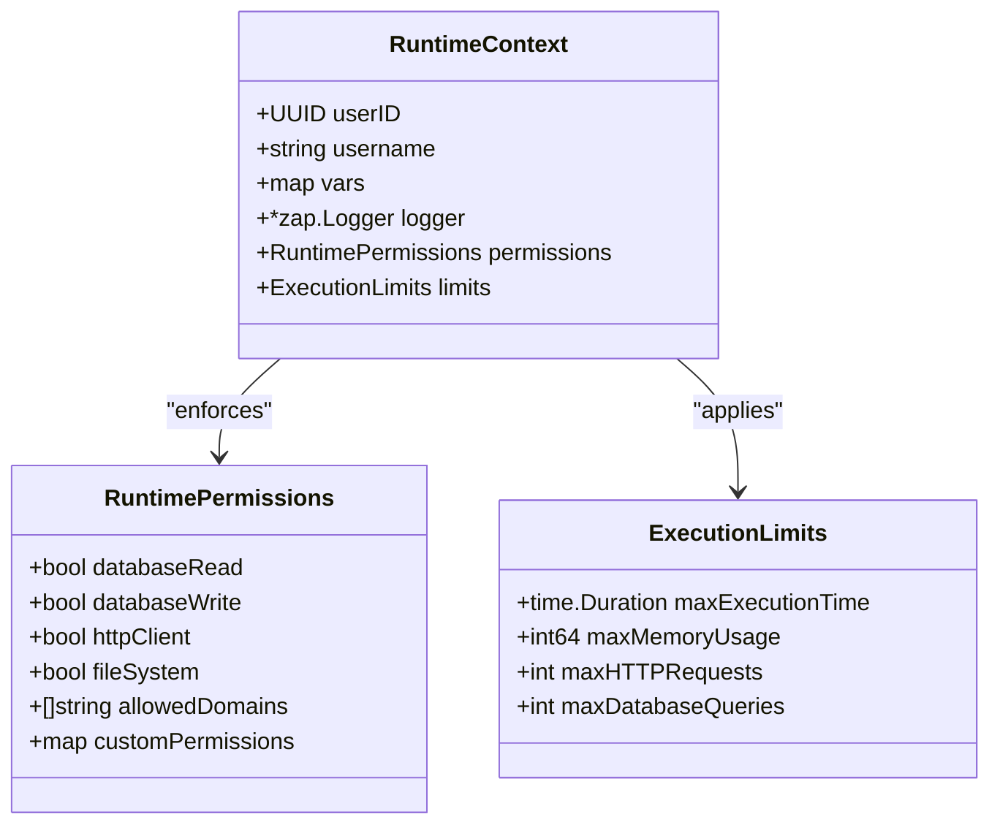

## Security Monitoring

### 1. Security Events

```mermaid
graph TB
    subgraph "Authentication Events"
        LoginSuccess[Successful Login]
        LoginFailure[Failed Login]
        AccountLockout[Account Lockout]
        PasswordChange[Password Change]
        MFAFailure[MFA Failure]
    end
    
    subgraph "Authorization Events"
        AccessDenied[Access Denied]
        PermissionEscalation[Permission Escalation]
        ResourceAccess[Resource Access]
        APIAbuse[API Abuse]
    end
    
    subgraph "System Events"
        ConfigChange[Configuration Change]
        KeyRotation[Key Rotation]
        SecurityUpdate[Security Update]
        RuntimeError[Runtime Error]
    end
    
    subgraph "Response Actions"
        AlertGeneration[Alert Generation]
        AutoBlocking[Automatic Blocking]
        AuditLogging[Audit Logging]
        IncidentResponse[Incident Response]
    end
    
    LoginFailure --> AlertGeneration
    APIAbuse --> AutoBlocking
    AccessDenied --> AuditLogging
    ConfigChange --> IncidentResponse
```

### 2. Audit Logging

```mermaid
classDiagram
    class SecurityEvent {
        +UUID eventID
        +string eventType
        +UUID userID
        +string username
        +string clientIP
        +string userAgent
        +map metadata
        +timestamp eventTime
        +SecurityLevel level
    }
    
    class SecurityLevel {
        +INFO = "info"
        +WARN = "warn"
        +ERROR = "error"
        +CRITICAL = "critical"
    }
    
    class AuditLogger {
        +LogEvent(event SecurityEvent)
        +QueryEvents(filters map[string]interface{}) []SecurityEvent
        +AlertOnPattern(pattern string, threshold int)
        +ArchiveOldEvents(age time.Duration)
    }
    
    SecurityEvent --> SecurityLevel : "categorized_by"
    AuditLogger --> SecurityEvent : "manages"
```

## Threat Model

### 1. Attack Vectors

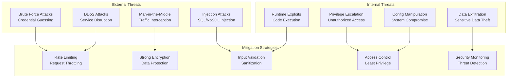

### 2. Security Best Practices

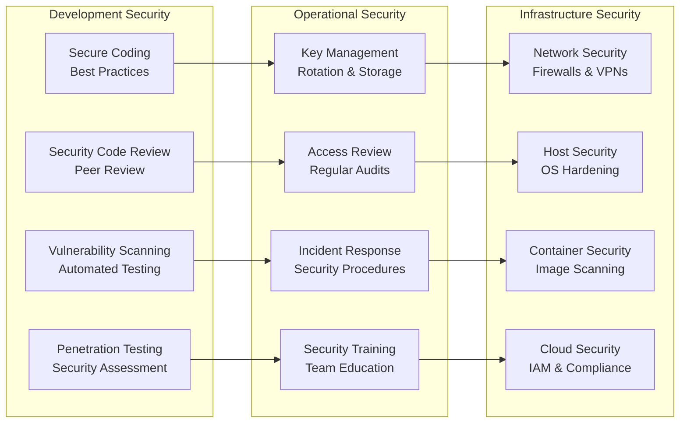

For more information on related topics:
- [API Architecture](api.md) - API security implementation details
- [Runtime Extensions](runtime.md) - Runtime security and isolation
- [Deployment Architecture](deployment.md) - Production security considerations