# Component Architecture

This document provides a detailed breakdown of Nakama's core components, their responsibilities, and interactions.

## Component Overview

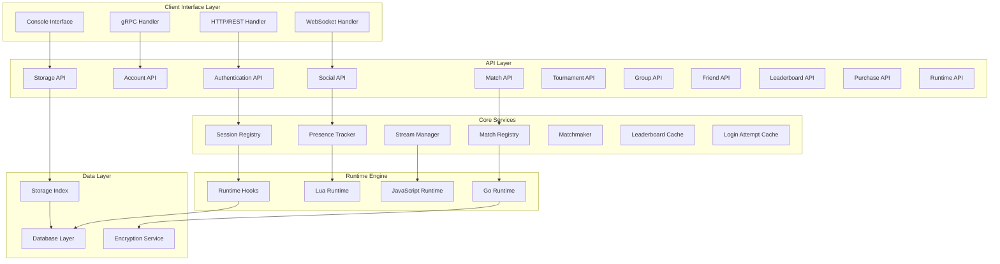

## Core Components Detail

### 1. Session Management

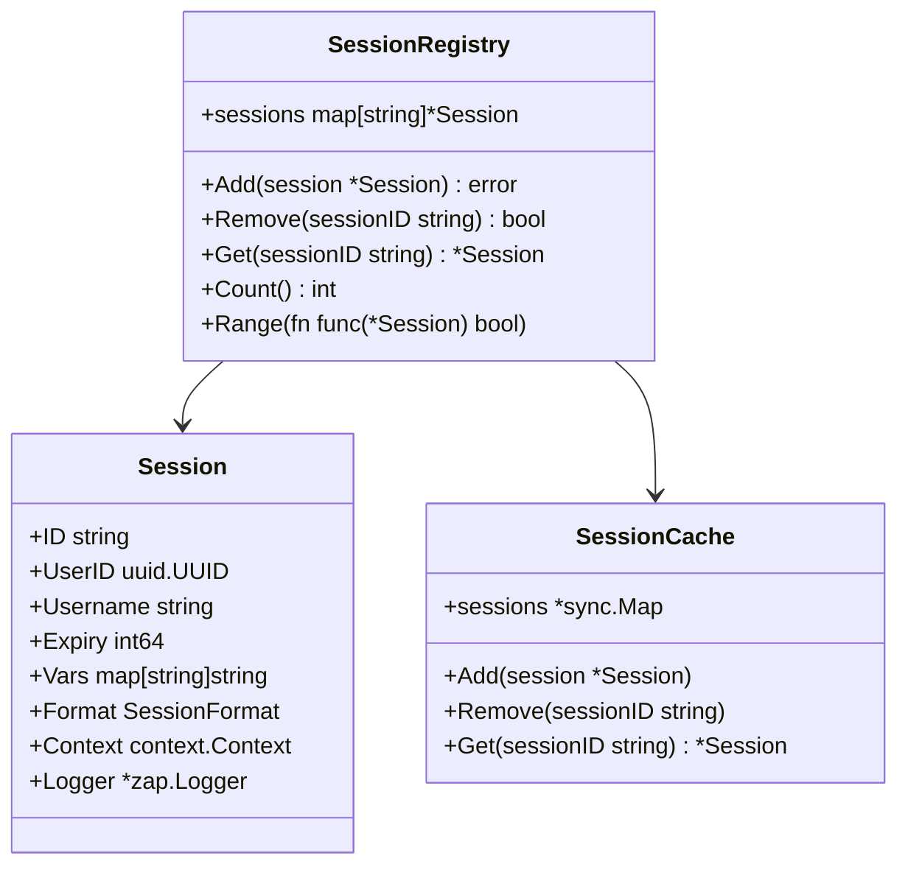

### 2. Match System

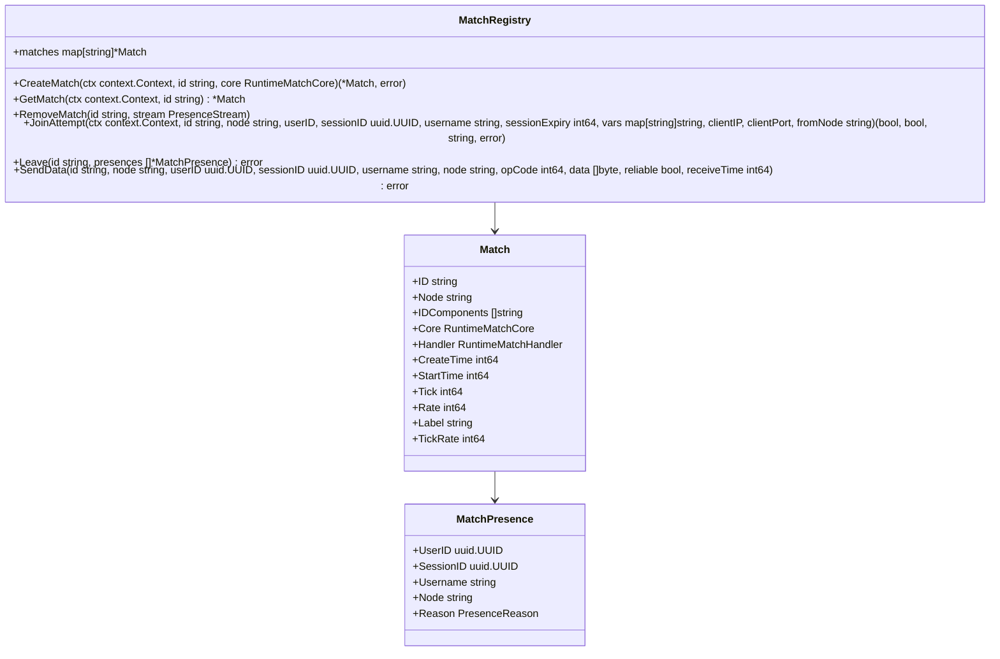

### 3. Real-time Communication

```mermaid
classDiagram
    class Tracker {
        +presences map[string]*PresenceMeta
        +Track(ctx context.Context, sessionID uuid.UUID, stream PresenceStream, userID uuid.UUID, meta PresenceMeta) (bool, bool)
        +Untrack(sessionID uuid.UUID, stream PresenceStream, userID uuid.UUID)
        +UntrackAll(sessionID uuid.UUID, reason ...PresenceReason)
        +Update(ctx context.Context, sessionID uuid.UUID, stream PresenceStream, userID uuid.UUID, meta PresenceMeta) (bool, bool)
        +GetByStream(stream PresenceStream) []*Presence
        +CountByStream(stream PresenceStream) int
    }
    
    class PresenceStream {
        +Mode uint8
        +Subject uuid.UUID
        +Subcontext uuid.UUID
        +Label string
    }
    
    class StreamManager {
        +streams map[PresenceStream]struct{}
        +RegisterStream(stream PresenceStream, authoritative bool)
        +UnregisterStream(stream PresenceStream)
        +SendToStream(logger *zap.Logger, stream PresenceStream, envelope *rtapi.Envelope, reliable bool)
    }
    
    Tracker --> PresenceStream
    StreamManager --> PresenceStream
```

### 4. Storage Engine

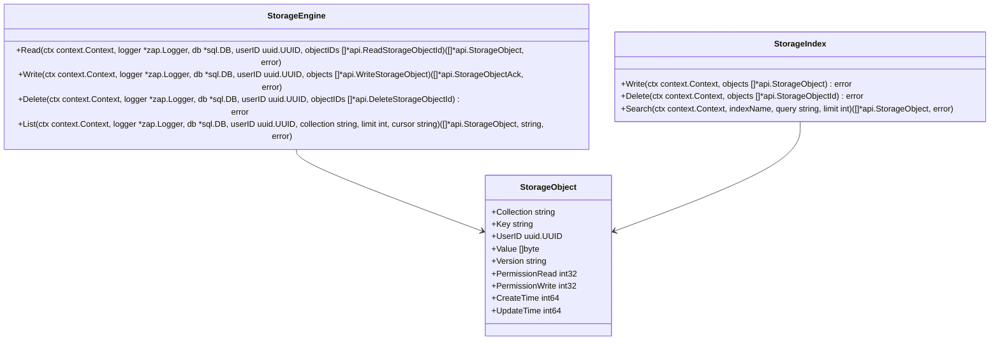

### 5. Matchmaker System

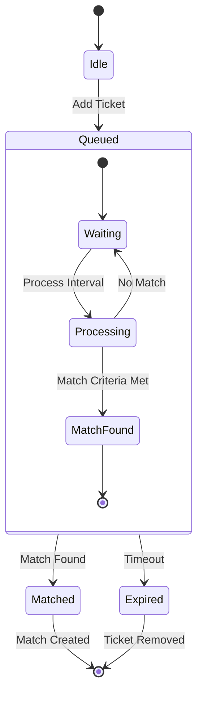

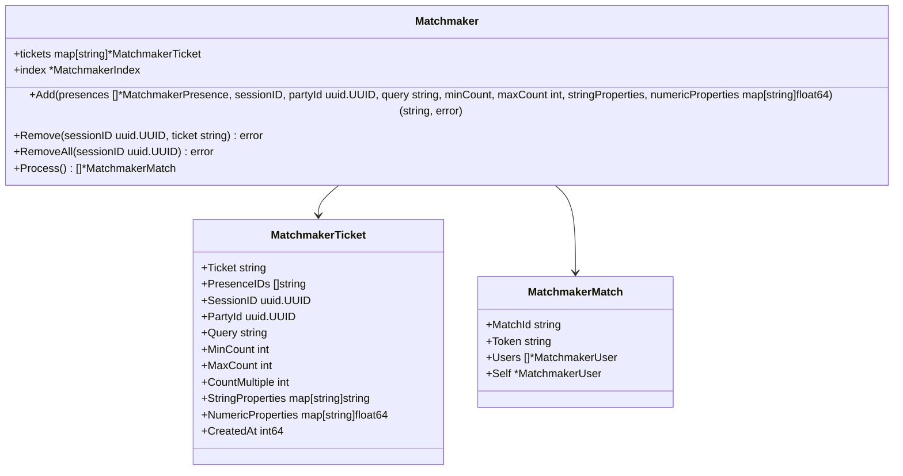

### 6. Runtime Engine Architecture

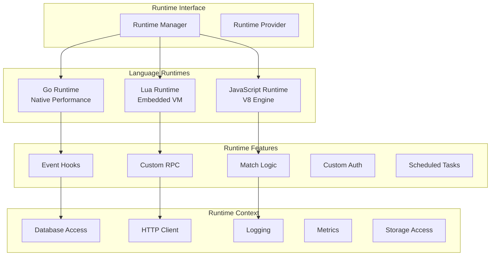

## Component Interactions

### Authentication Flow
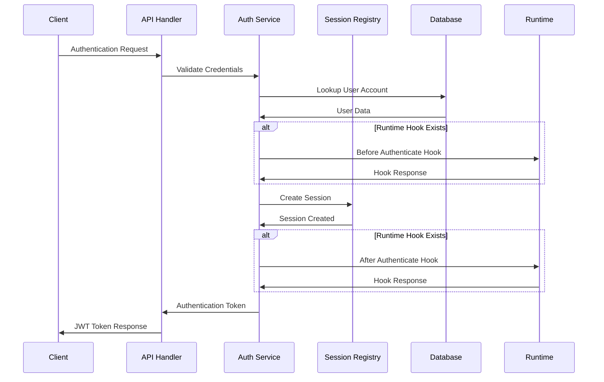

### Real-time Message Flow
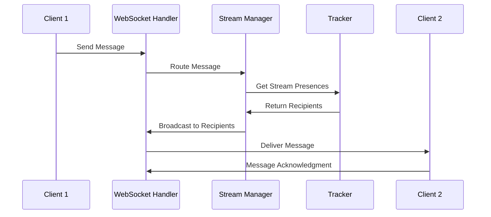

### Storage Operation Flow
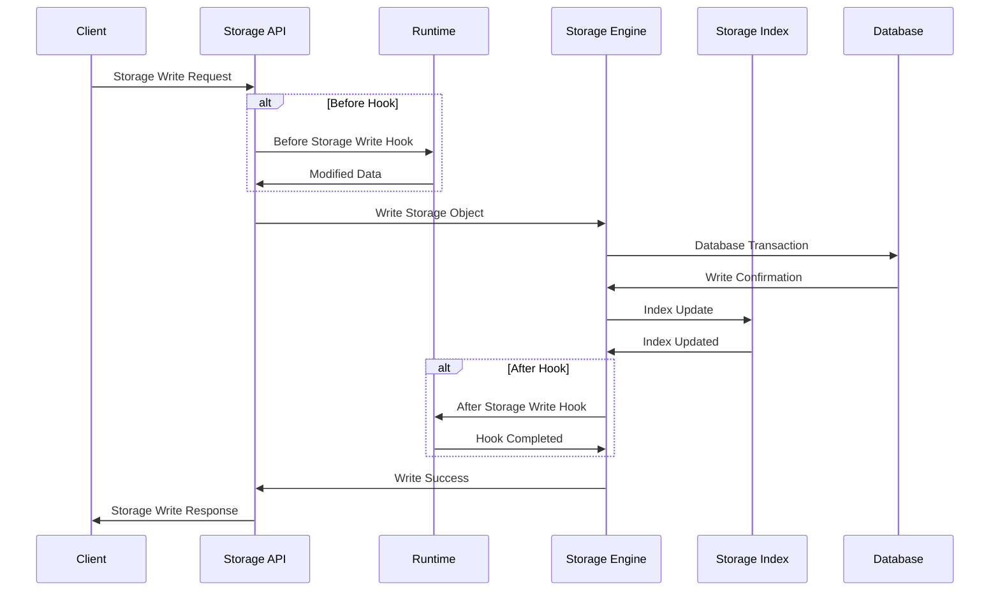

## Performance Characteristics

### Memory Usage Patterns
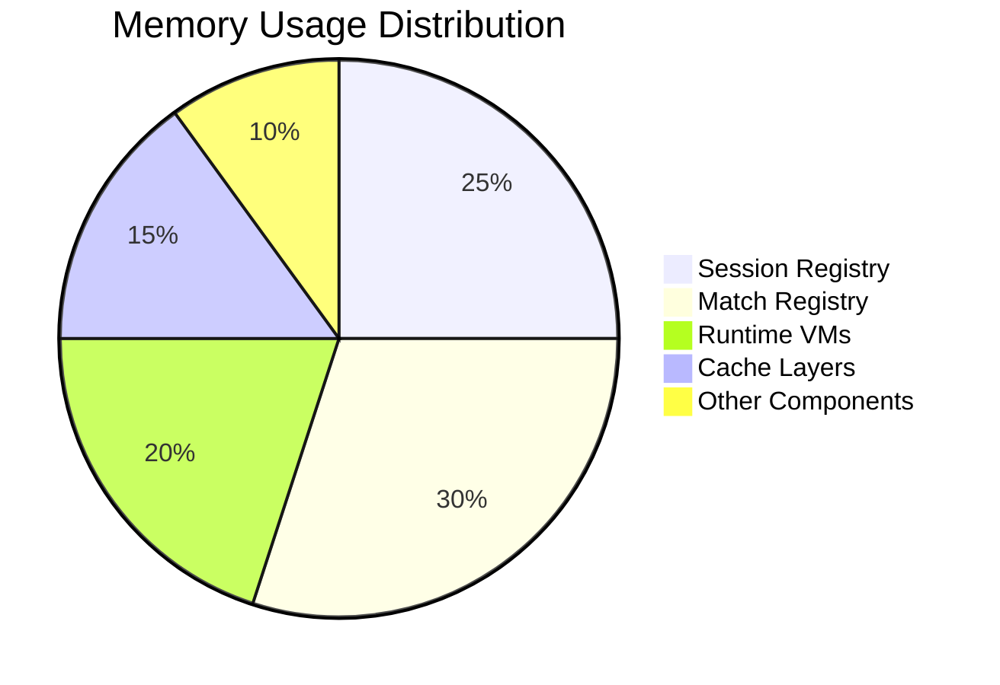

### CPU Usage Patterns
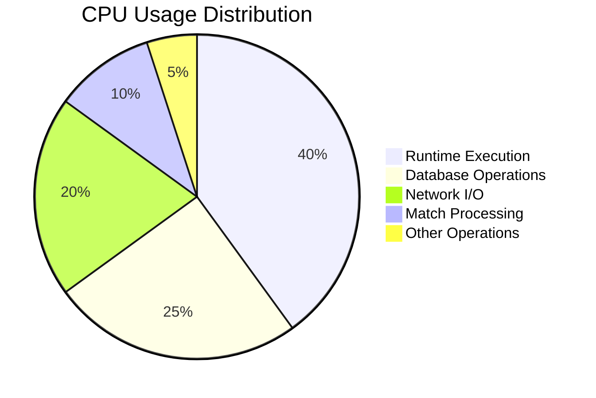

## Scaling Considerations

### Horizontal Scaling Components
- **Stateless**: API handlers, Runtime engine (mostly)
- **Session Affinity Required**: WebSocket connections, Match instances
- **Shared State**: Database, Cache layers

### Resource Requirements
- **CPU Intensive**: Runtime execution, Match processing
- **Memory Intensive**: Session registry, Match registry, Runtime VMs
- **I/O Intensive**: Database operations, Network communication

### Bottleneck Analysis
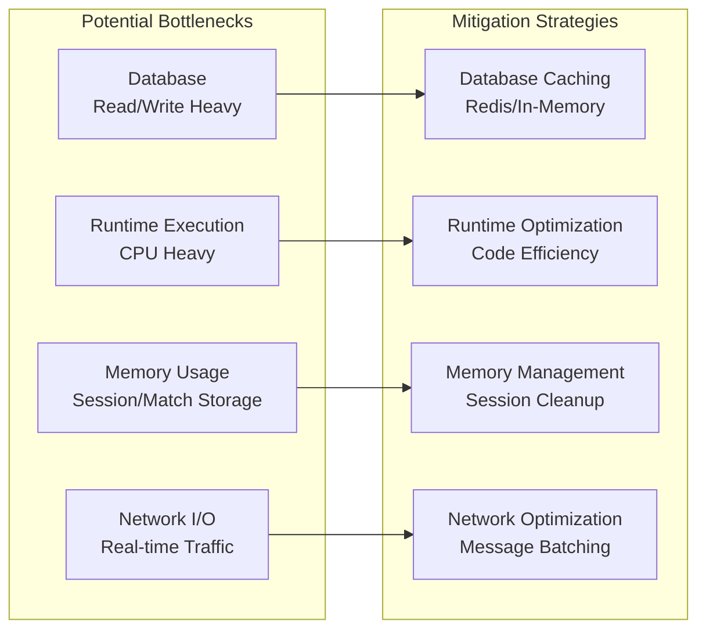

## Component Health Monitoring

Each component exposes health metrics and status information:

- **Response Times**: Per-operation latency tracking
- **Error Rates**: Component-specific error tracking
- **Resource Usage**: Memory, CPU, and connection metrics
- **Business Metrics**: Active sessions, matches, storage operations

For detailed monitoring setup, see the [Deployment Architecture](deployment.md#monitoring) documentation.