# Database Architecture

This document details Nakama's database design, schema structure, and data modeling patterns. Nakama primarily uses CockroachDB but is compatible with PostgreSQL.

## Database Technology Stack

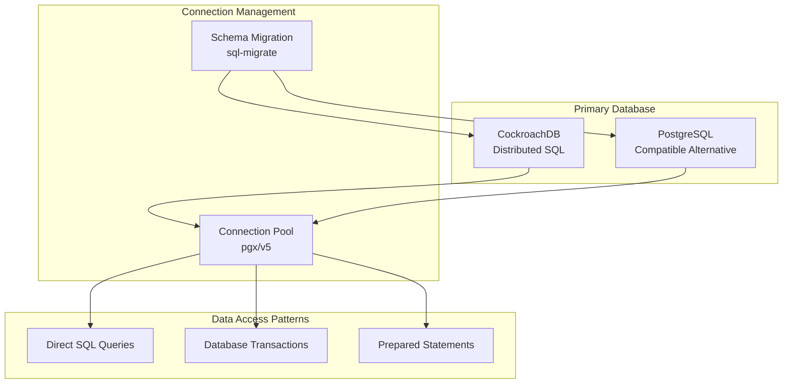

## Schema Overview

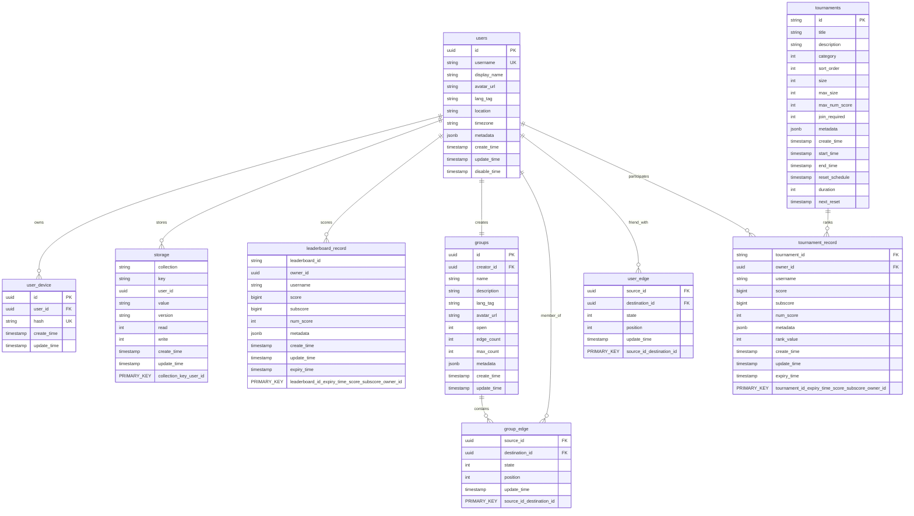

## Core Data Models

### 1. User Management

```mermaid
classDiagram
    class User {
        +UUID id
        +string username
        +string display_name
        +string avatar_url
        +string lang_tag
        +string location
        +string timezone
        +map metadata
        +timestamp create_time
        +timestamp update_time
        +timestamp disable_time
    }
    
    class UserDevice {
        +UUID id
        +UUID user_id
        +string hash
        +timestamp create_time
        +timestamp update_time
    }
    
    class UserAccount {
        +UUID user_id
        +string email
        +string custom_id
        +string google_id
        +string apple_id
        +string facebook_id
        +string steam_id
        +string gameCenter_id
        +timestamp create_time
        +timestamp update_time
    }
    
    User ||--o{ UserDevice : "has"
    User ||--|| UserAccount : "authenticated_by"
```

### 2. Storage System

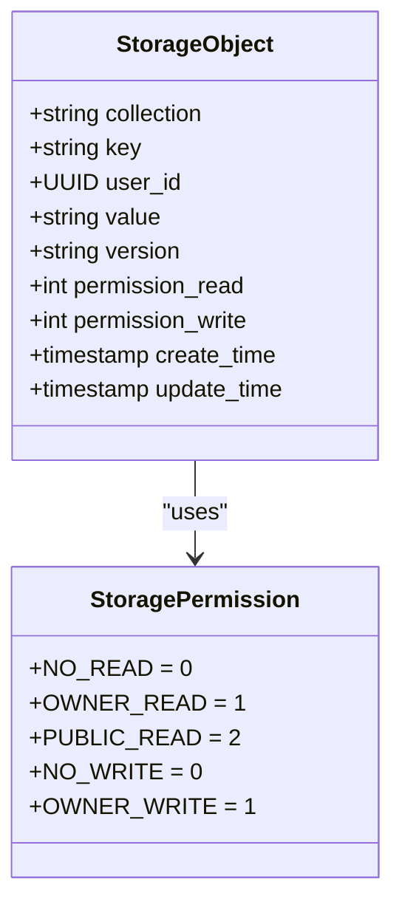

### 3. Social Features

```mermaid
classDiagram
    class UserEdge {
        +UUID source_id
        +UUID destination_id
        +int state
        +int position
        +timestamp update_time
    }
    
    class EdgeState {
        +FRIEND = 0
        +INVITE_SENT = 1
        +INVITE_RECEIVED = 2
        +BLOCKED = 3
    }
    
    class Group {
        +UUID id
        +UUID creator_id
        +string name
        +string description
        +string lang_tag
        +string avatar_url
        +int open
        +int edge_count
        +int max_count
        +map metadata
        +timestamp create_time
        +timestamp update_time
    }
    
    class GroupEdge {
        +UUID source_id
        +UUID destination_id
        +int state
        +int position
        +timestamp update_time
    }
    
    UserEdge --> EdgeState : "has"
    Group ||--o{ GroupEdge : "contains"
```

## Data Access Patterns

### 1. Read Patterns

```mermaid
graph TB
    subgraph "Read Operations"
        SingleRead[Single Record Read<br/>By Primary Key]
        BatchRead[Batch Read<br/>Multiple Records]
        IndexRead[Index-based Read<br/>Secondary Indices]
        ScanRead[Sequential Scan<br/>Full Table]
    end
    
    subgraph "Performance Characteristics"
        Fast[O(1) - Very Fast]
        Moderate[O(log n) - Moderate]
        Slow[O(n) - Slow]
    end
    
    SingleRead --> Fast
    IndexRead --> Fast
    BatchRead --> Moderate
    ScanRead --> Slow
```

### 2. Write Patterns

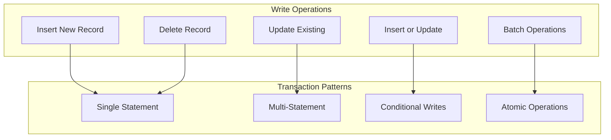

## Query Optimization Strategies

### 1. Indexing Strategy

```sql
-- Primary indices (automatically created)
PRIMARY KEY (id)
PRIMARY KEY (collection, key, user_id)

-- Secondary indices for common queries
CREATE INDEX users_username_index ON users (username) WHERE disable_time IS NULL;
CREATE INDEX storage_user_collection_index ON storage (user_id, collection);
CREATE INDEX leaderboard_record_rank_index ON leaderboard_record (leaderboard_id, expiry_time, score DESC, subscore DESC);
CREATE INDEX group_edge_destination_index ON group_edge (destination_id, state, position);
CREATE INDEX user_edge_destination_index ON user_edge (destination_id, state, position);

-- Composite indices for complex queries
CREATE INDEX tournament_record_tournament_rank ON tournament_record (tournament_id, expiry_time, rank_value);
```

### 2. Query Performance Patterns

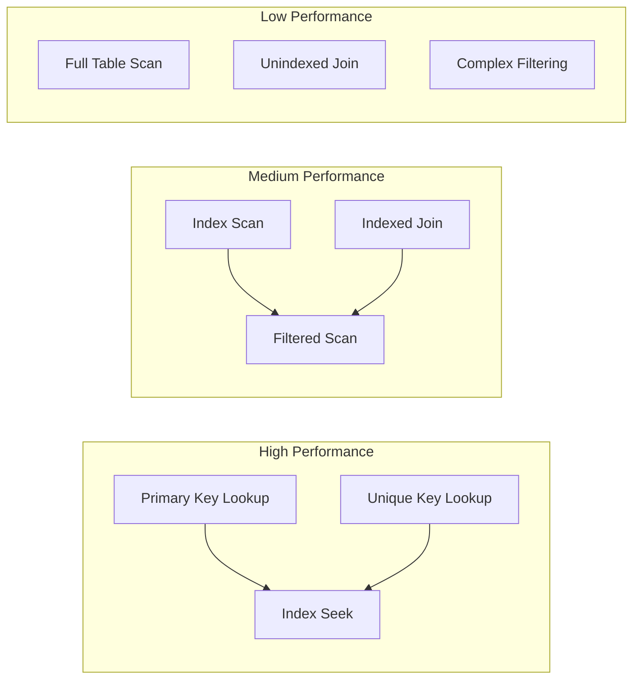

## Transaction Management

### 1. Transaction Isolation Levels

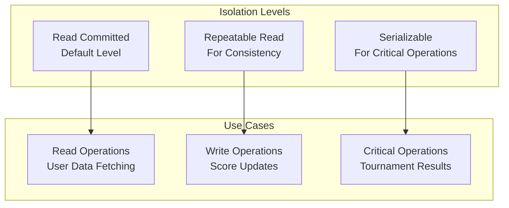

### 2. Transaction Patterns

```sql
-- Simple transaction
BEGIN;
UPDATE users SET display_name = $1, update_time = now() WHERE id = $2;
COMMIT;

-- Complex transaction with conditional logic
BEGIN;
SELECT version FROM storage WHERE collection = $1 AND key = $2 AND user_id = $3 FOR UPDATE;
-- Check version and update conditionally
UPDATE storage SET value = $4, version = $5, update_time = now() 
WHERE collection = $1 AND key = $2 AND user_id = $3 AND version = $6;
COMMIT;

-- Batch operation
BEGIN;
INSERT INTO leaderboard_record (leaderboard_id, owner_id, username, score, ...)
VALUES ($1, $2, $3, $4, ...), ($5, $6, $7, $8, ...), ...
ON CONFLICT (leaderboard_id, expiry_time, score, subscore, owner_id) 
DO UPDATE SET score = EXCLUDED.score, update_time = now();
COMMIT;
```

## Data Consistency Patterns

### 1. Eventual Consistency

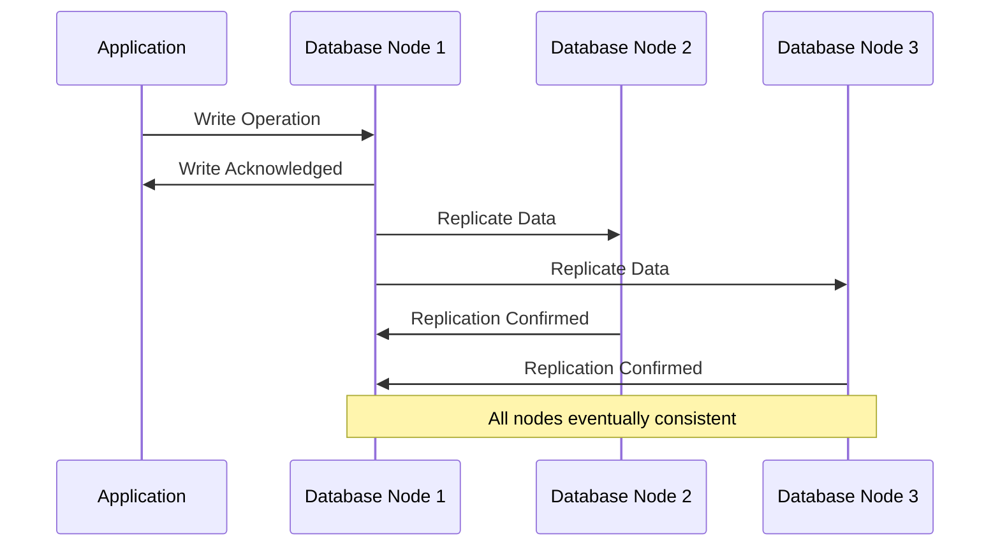

### 2. Strong Consistency

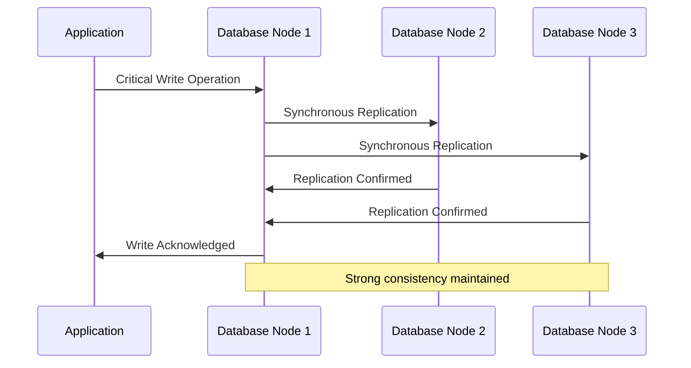

## Scaling Strategies

### 1. Horizontal Scaling (CockroachDB)

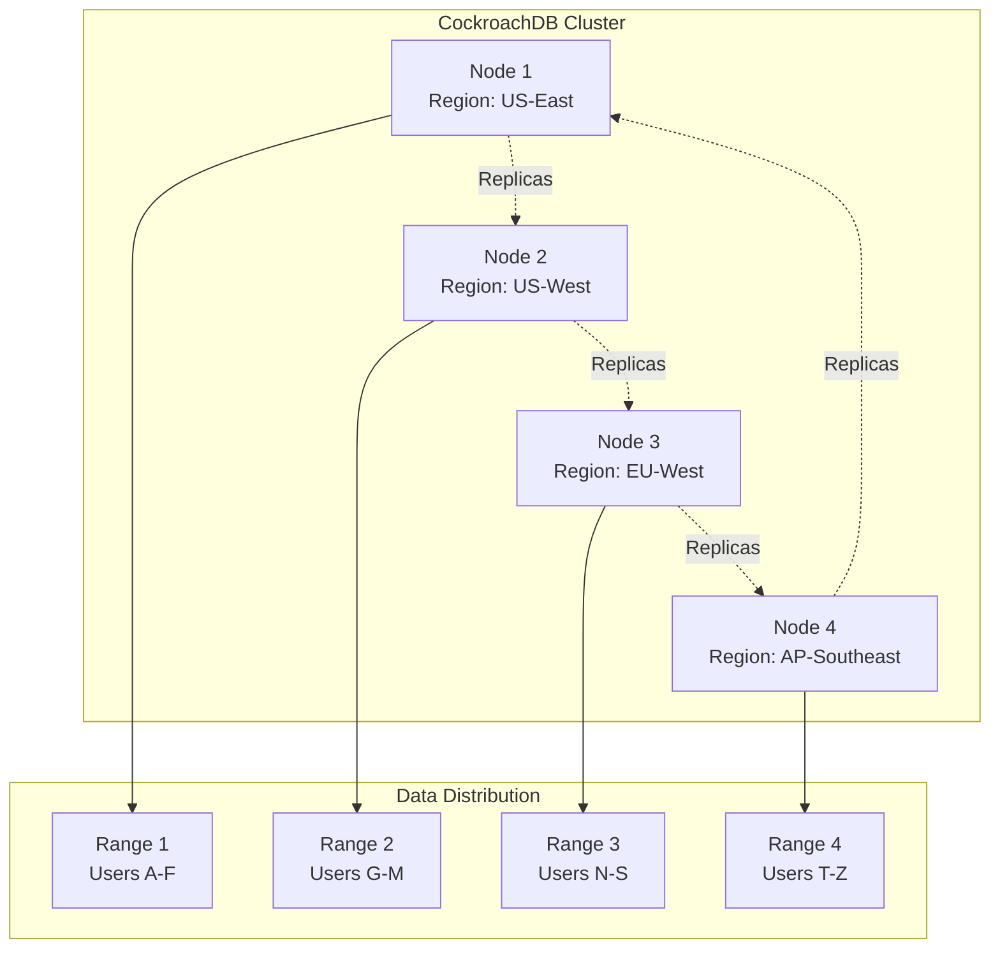

### 2. Read Replicas (PostgreSQL)

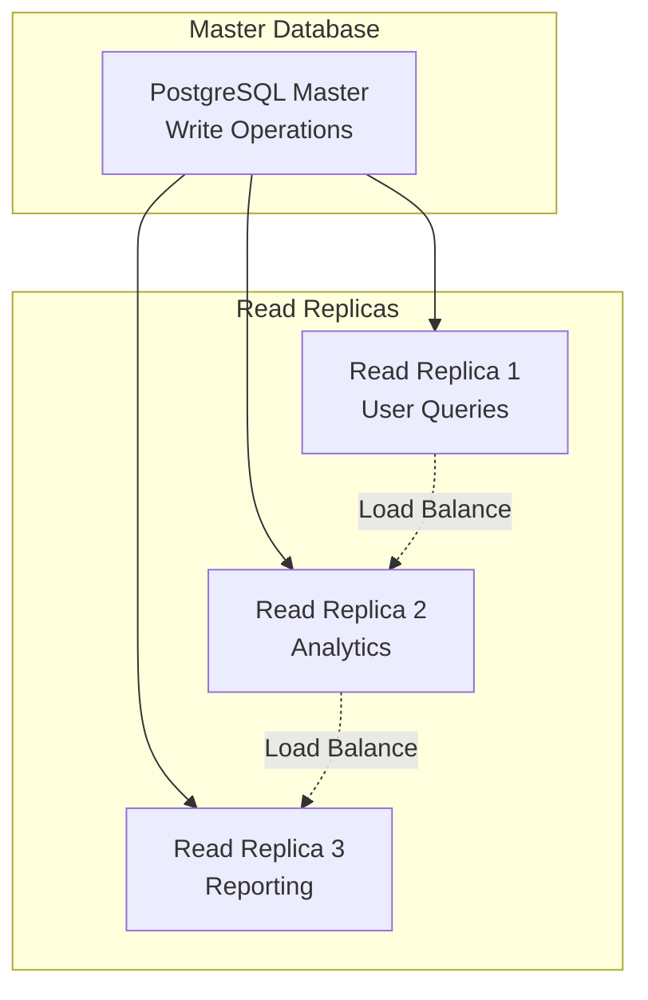

## Data Migration and Versioning

### 1. Schema Migration Process

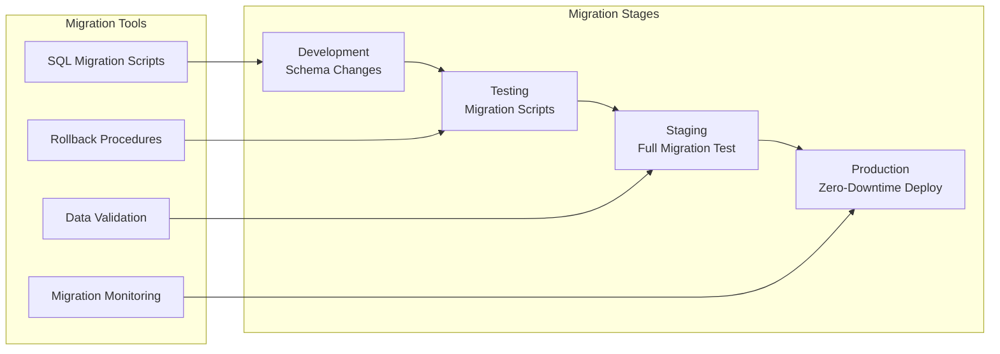

### 2. Zero-Downtime Migration Strategy

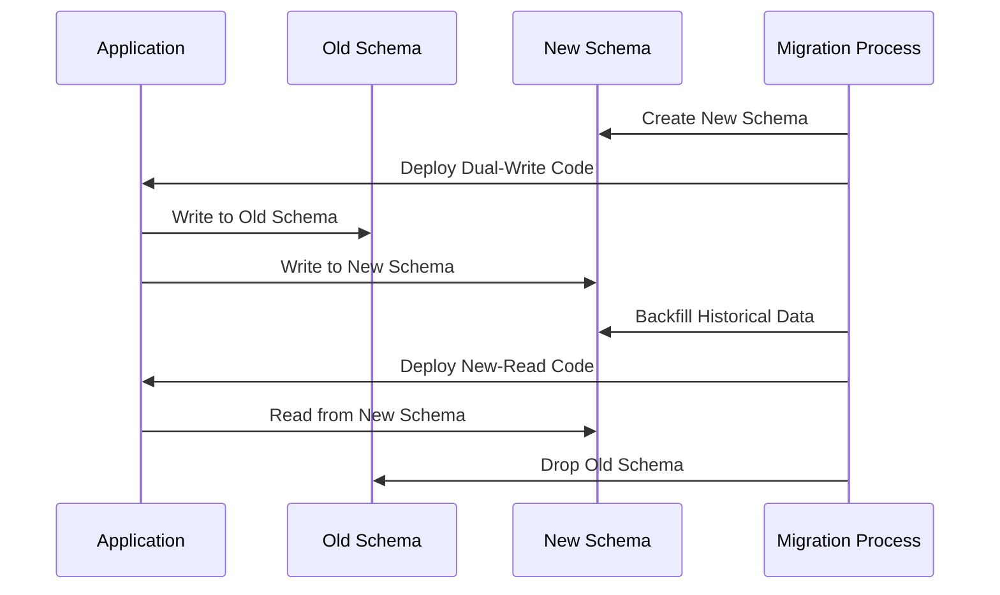

## Performance Monitoring

### 1. Key Metrics

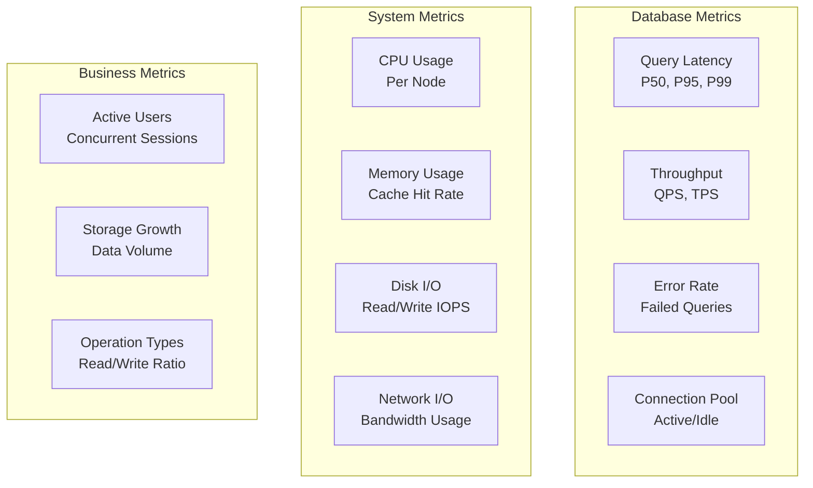

### 2. Query Performance Analysis

```sql
-- Slow query analysis (PostgreSQL)
SELECT query, calls, total_time, mean_time, rows
FROM pg_stat_statements
ORDER BY mean_time DESC
LIMIT 10;

-- Index usage analysis
SELECT schemaname, tablename, attname, n_distinct, correlation
FROM pg_stats
WHERE tablename IN ('users', 'storage', 'leaderboard_record')
ORDER BY n_distinct DESC;

-- Connection monitoring
SELECT state, count(*)
FROM pg_stat_activity
GROUP BY state;
```

## Backup and Recovery

### 1. Backup Strategy

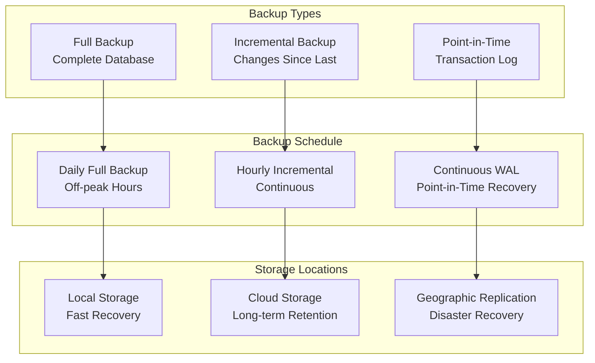

### 2. Recovery Procedures

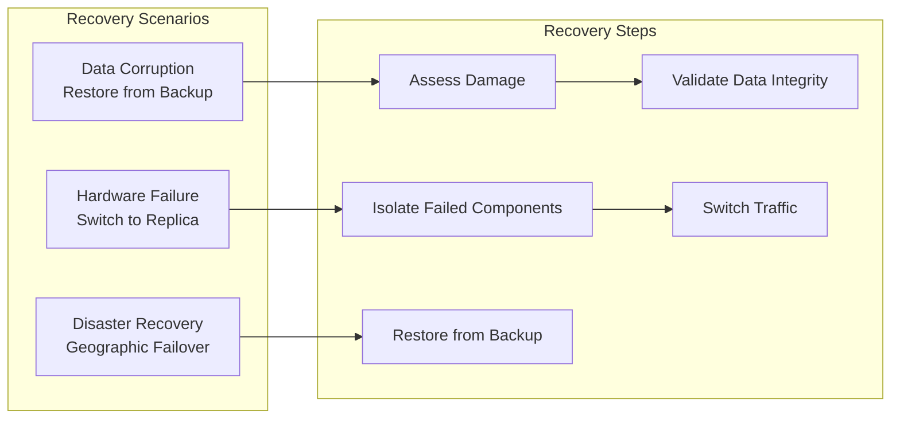

For more information on related topics:
- [Component Architecture](components.md) - How components interact with the database
- [API Architecture](api.md) - How APIs access and modify data
- [Deployment Architecture](deployment.md) - Production database deployment patterns