# Deployment Architecture

This document details production deployment patterns, infrastructure requirements, monitoring, and operational considerations for Nakama.

## Deployment Overview

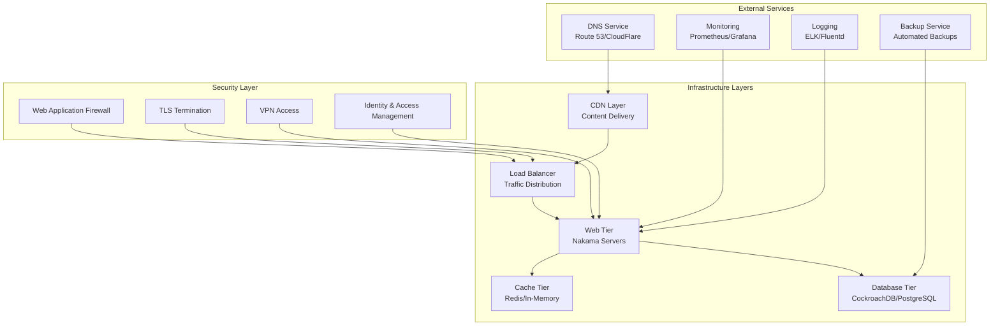

## Infrastructure Patterns

### 1. Single Region Deployment

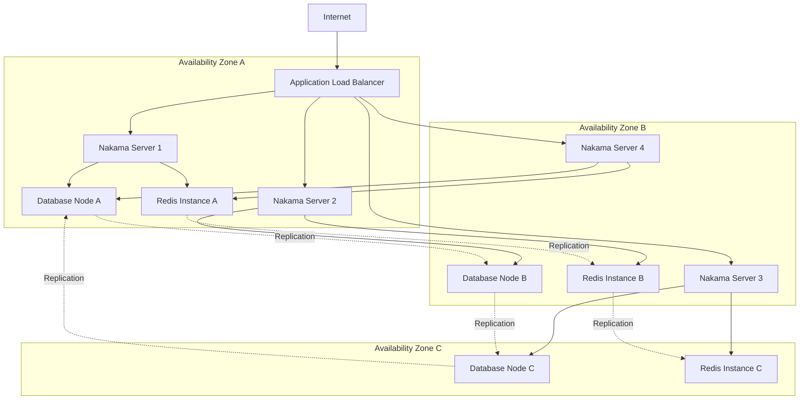

### 2. Multi-Region Deployment

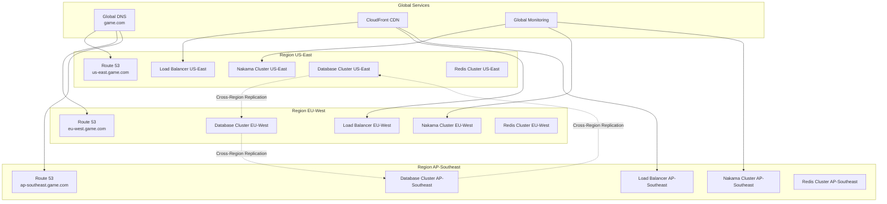

## Container Orchestration

### 1. Kubernetes Deployment

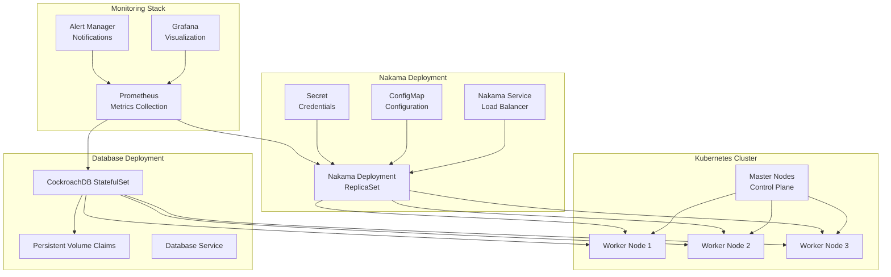

### 2. Docker Compose Development

```yaml
# docker-compose.yml example
version: '3.8'

services:
  nakama:
    image: heroiclabs/nakama:3.0.0
    entrypoint:
      - "/bin/sh"
      - "-ecx"
      - >
        /nakama/nakama migrate up --database.address root@cockroachdb:26257 &&
        exec /nakama/nakama --name nakama1 --database.address root@cockroachdb:26257 --logger.level INFO --session.token_expiry_sec 7200 --runtime.path /nakama/data/modules
    restart: "unless-stopped"
    links:
      - "cockroachdb:db"
    depends_on:
      - cockroachdb
      - redis
    volumes:
      - ./data:/nakama/data
    expose:
      - "7349"
      - "7350"
      - "7351"
    ports:
      - "7349:7349"
      - "7350:7350"
      - "7351:7351"
    healthcheck:
      test: ["CMD", "/nakama/nakama", "healthcheck"]
      interval: 30s
      timeout: 10s
      retries: 5

  cockroachdb:
    image: cockroachdb/cockroach:latest-v21.2
    command: start-single-node --insecure --store=attrs=ssd,path=/var/lib/cockroach/
    restart: "unless-stopped"
    volumes:
      - data:/var/lib/cockroach
    expose:
      - "8080"
      - "26257"
    ports:
      - "26257:26257"
      - "8080:8080"
    healthcheck:
      test: ["CMD", "curl", "-f", "http://localhost:8080/health?ready=1"]
      interval: 30s
      timeout: 10s
      retries: 5

  redis:
    image: redis:7-alpine
    command: redis-server --appendonly yes
    restart: "unless-stopped"
    volumes:
      - redis:/data
    expose:
      - "6379"
    ports:
      - "6379:6379"
    healthcheck:
      test: ["CMD", "redis-cli", "ping"]
      interval: 30s
      timeout: 10s
      retries: 5

volumes:
  data:
  redis:
```

## Cloud Provider Deployments

### 1. AWS Deployment

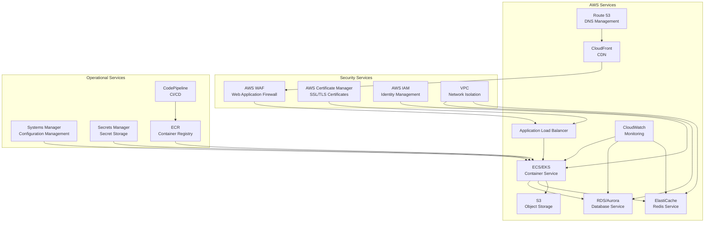

### 2. Google Cloud Platform Deployment

```mermaid
graph TB
    subgraph "GCP Services"
        CloudDNS[Cloud DNS<br/>DNS Management]
        CloudCDN[Cloud CDN<br/>Content Delivery]
        LoadBalancer[Load Balancer<br/>HTTP(S) LB]
        GKE[GKE<br/>Kubernetes Engine]
        CloudSQL[Cloud SQL<br/>PostgreSQL]
        Memorystore[Memorystore<br/>Redis Service]
        CloudStorage[Cloud Storage<br/>Object Storage]
        Monitoring[Cloud Monitoring<br/>Stackdriver]
    end
    
    subgraph "Security Services"
        CloudArmor[Cloud Armor<br/>DDoS Protection]
        IAM[Cloud IAM<br/>Identity Management]
        VPC[VPC<br/>Network Security]
        KMS[Cloud KMS<br/>Key Management]
    end
    
    subgraph "DevOps Services"
        CloudBuild[Cloud Build<br/>CI/CD]
        ContainerRegistry[Container Registry<br/>Image Storage]
        ConfigManagement[Config Management<br/>GitOps]
        SecretManager[Secret Manager<br/>Secret Storage]
    end
    
    CloudDNS --> CloudCDN
    CloudCDN --> CloudArmor
    CloudArmor --> LoadBalancer
    LoadBalancer --> GKE
    GKE --> CloudSQL
    GKE --> Memorystore
    GKE --> CloudStorage
    
    IAM --> GKE
    VPC --> CloudSQL
    VPC --> Memorystore
    KMS --> SecretManager
    
    CloudBuild --> ContainerRegistry
    ContainerRegistry --> GKE
    ConfigManagement --> GKE
    SecretManager --> GKE
    
    Monitoring --> GKE
    Monitoring --> CloudSQL
    Monitoring --> Memorystore
```

## Configuration Management

### 1. Environment Configuration

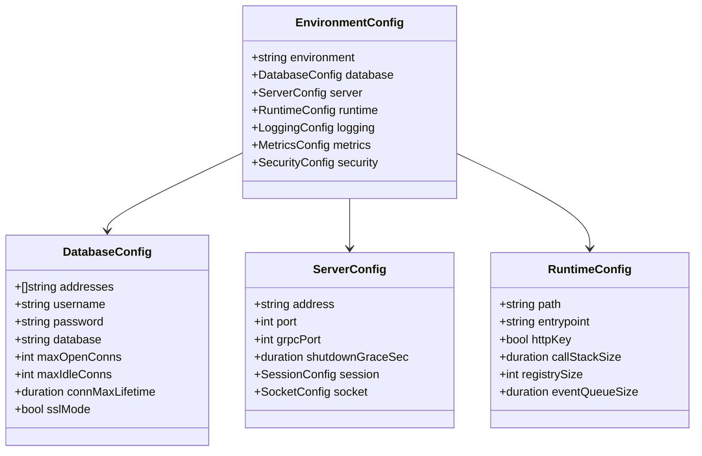

### 2. Configuration Sources

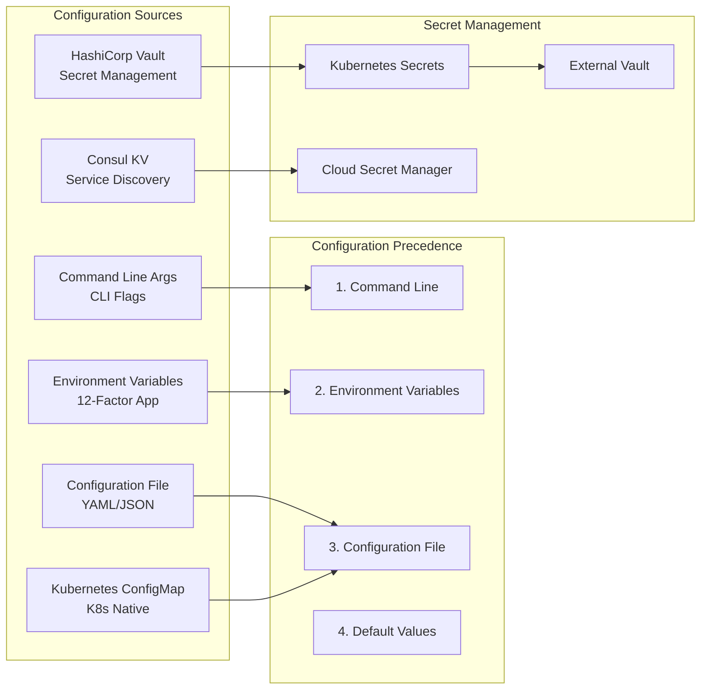

## Monitoring and Observability

### 1. Monitoring Stack

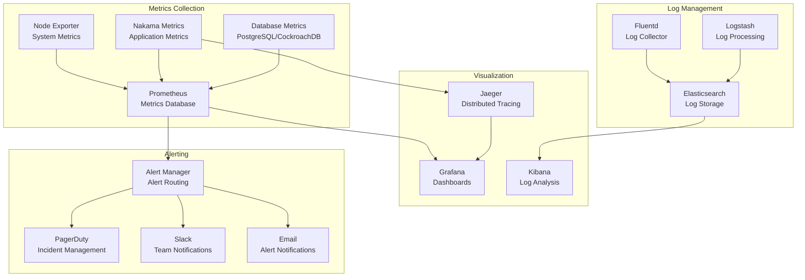

### 2. Key Metrics Dashboard

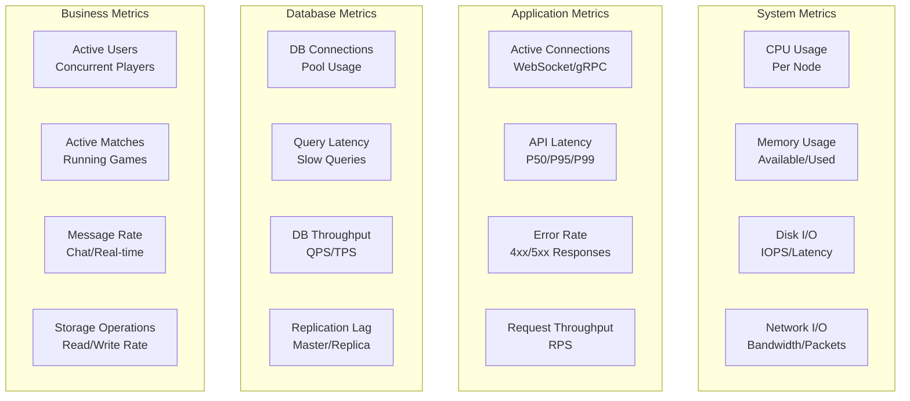

## Security Hardening

### 1. Network Security

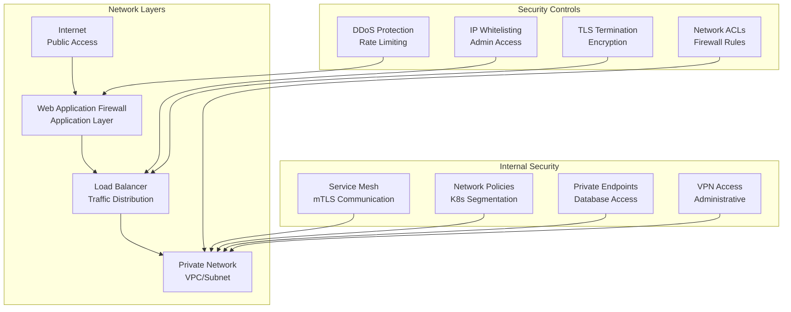

### 2. Application Security

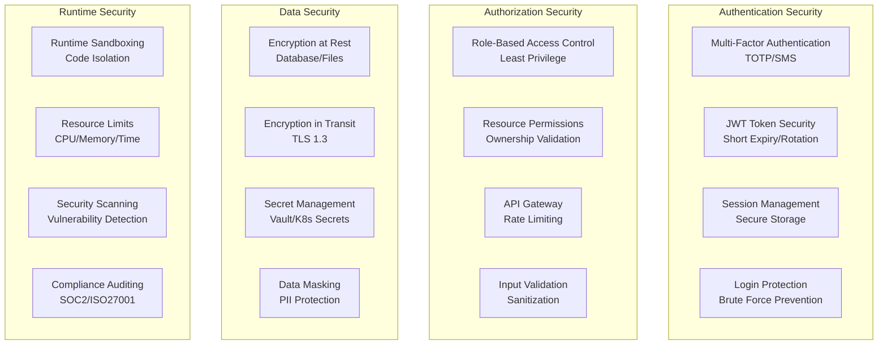

## Backup and Disaster Recovery

### 1. Backup Strategy

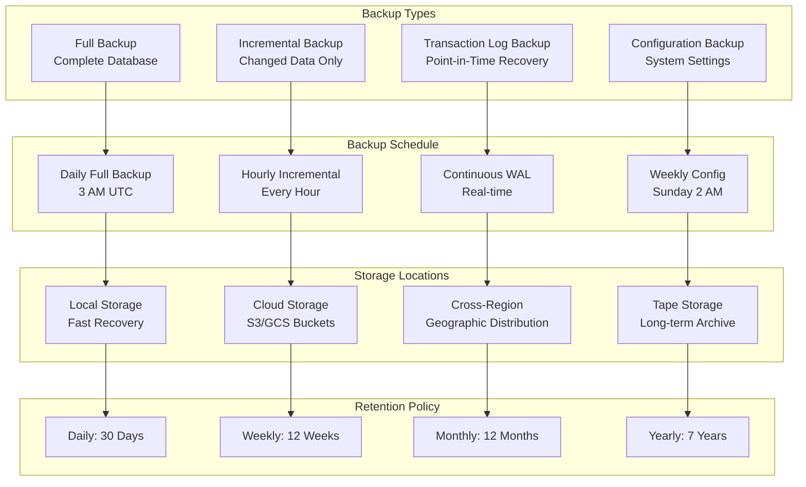

### 2. Disaster Recovery Plan

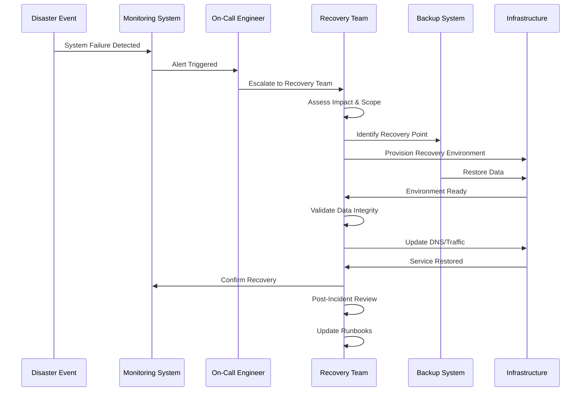

## Performance Optimization

### 1. Application Performance

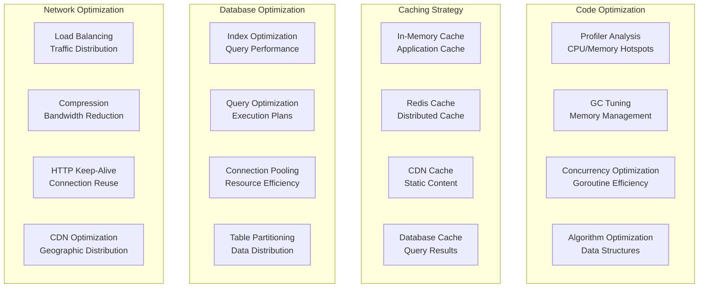

### 2. Scaling Strategies

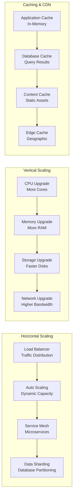

## Cost Optimization

### 1. Resource Optimization

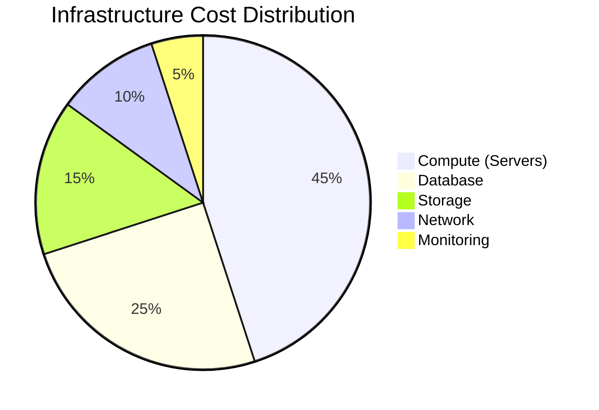

### 2. Cost Management Strategies

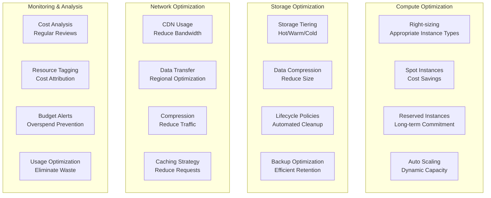

For more information on related topics:
- [Component Architecture](components.md) - Deployment component details
- [Database Architecture](database.md) - Database deployment patterns
- [Authentication & Authorization](auth.md) - Security deployment considerations

## Fork-Specific Deployment Assets

This repository ships concrete deployment assets that implement the patterns
described above:

- **Release pipeline**: [`.github/workflows/release.yml`](../../.github/workflows/release.yml)
  builds multi-arch (linux/amd64, linux/arm64) container images stamped with
  version and commit metadata, and publishes them to GHCR as
  `ghcr.io/kaw-ai/nakama`.
- **Security gates**: [`.github/workflows/security.yml`](../../.github/workflows/security.yml)
  runs govulncheck and Trivy dependency scanning.
- **Per-environment configuration**: [`deploy/config/`](../../deploy/config/)
  contains dev, staging, and production configuration templates with
  secret-injection guidance.
- **Kubernetes manifests**: [`deploy/kubernetes/`](../../deploy/kubernetes/)
  provides a pre-deploy migration job, the server deployment with readiness/
  liveness probes and connection-drain settings, and internal/external
  services.
- **Runbooks**: [`docs/operations/runbooks.md`](../operations/runbooks.md)
  documents restart, deploy, rollback, config change, scaling, and backup
  procedures, plus monitoring and alerting guidance.

See [`deploy/README.md`](../../deploy/README.md) for the full deployment guide,
including database strategy, runtime module packaging, and network topology.