# Real-time Communication Architecture

This document details Nakama's real-time communication systems, including WebSocket management, matchmaking, and real-time features.

## Real-time System Overview

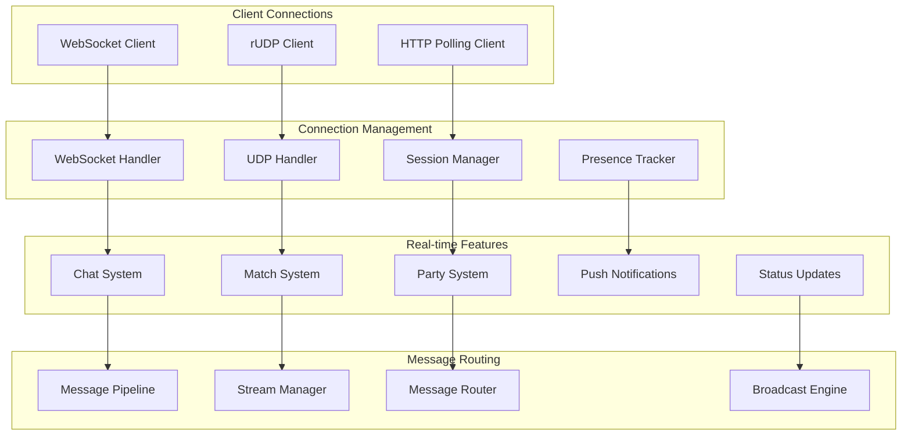
```mermaid
graph TB
    subgraph "Client Connections"
        WSClient[WebSocket Client]
        UDPClient[rUDP Client]
        HTTPClient[HTTP Polling Client]
    end
    
    subgraph "Connection Management"
        WSHandler[WebSocket Handler]
        UDPHandler[UDP Handler]
        SessionMgr[Session Manager]
        Tracker[Presence Tracker]
    end
    
    subgraph "Real-time Features"
        Chat[Chat System]
        Matches[Match System]
        Parties[Party System]
        Notifications[Push Notifications]
        Status[Status Updates]
    end
    
    subgraph "Message Routing"
        Pipeline[Message Pipeline]
        StreamMgr[Stream Manager]
        Router[Message Router]
        Broadcast[Broadcast Engine]
    end
    
    WSClient --> WSHandler
    UDPClient --> UDPHandler
    HTTPClient --> SessionMgr
    
    WSHandler --> Chat
    UDPHandler --> Matches
    SessionMgr --> Parties
    Tracker --> Notifications
    
    Chat --> Pipeline
    Matches --> StreamMgr
    Parties --> Router
    Status --> Broadcast
```

## WebSocket Architecture

### 1. Connection Management

```mermaid
classDiagram
    class SocketRegistry {
        +connections map[uuid.UUID]*SocketWS
        +Add(sessionID uuid.UUID, socket *SocketWS)
        +Remove(sessionID uuid.UUID)
        +Get(sessionID uuid.UUID) *SocketWS
        +Range(fn func(*SocketWS) bool)
        +Count() int
    }
    
    class SocketWS {
        +sessionID uuid.UUID
        +userID uuid.UUID
        +username string
        +conn *websocket.Conn
        +format SessionFormat
        +pingPeriod time.Duration
        +pongWait time.Duration
        +writeWait time.Duration
        +messageSizeLimit int64
        +outgoingCh chan []byte
        +stopCh chan struct{}
    }
    
    class SessionFormat {
        +JSON = 0
        +PROTOBUF = 1
    }
    
    SocketRegistry --> SocketWS : "manages"
    SocketWS --> SessionFormat : "uses"
```

### 2. WebSocket Lifecycle

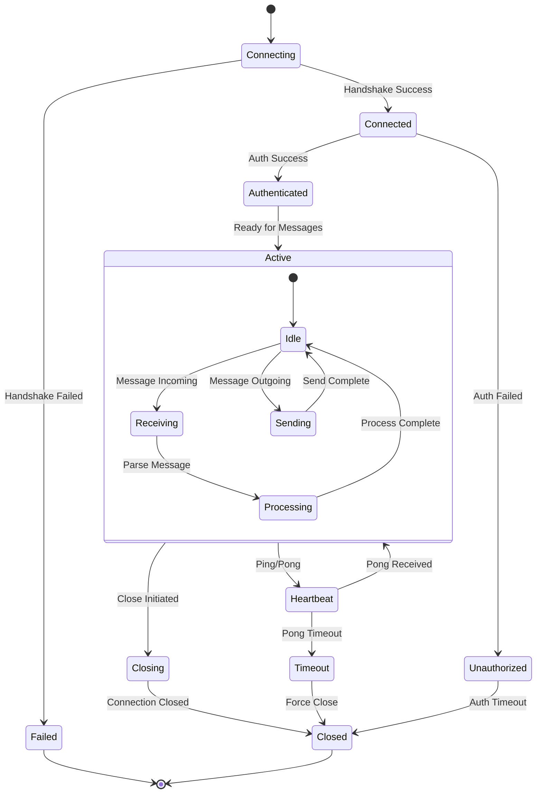
```mermaid
stateDiagram-v2
    [*] --> Connecting
    Connecting --> Connected: Handshake Success
    Connecting --> Failed: Handshake Failed
    Connected --> Authenticated: Auth Success
    Connected --> Unauthorized: Auth Failed
    Authenticated --> Active: Ready for Messages
    Active --> Heartbeat: Ping/Pong
    Heartbeat --> Active: Pong Received
    Heartbeat --> Timeout: Pong Timeout
    Active --> Closing: Close Initiated
    Closing --> Closed: Connection Closed
    Timeout --> Closed: Force Close
    Unauthorized --> Closed: Auth Timeout
    Failed --> [*]
    Closed --> [*]
    
    state Active {
        [*] --> Idle
        Idle --> Receiving: Message Incoming
        Idle --> Sending: Message Outgoing
        Receiving --> Processing: Parse Message
        Processing --> Idle: Process Complete
        Sending --> Idle: Send Complete
    }
```

### 3. Message Protocol

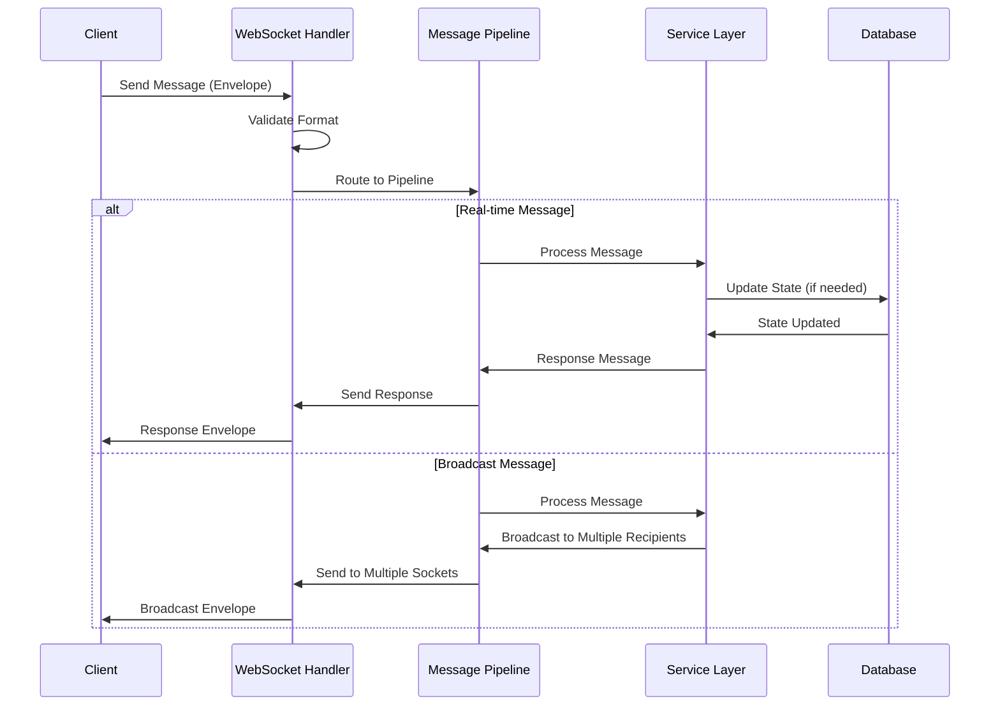
```mermaid
sequenceDiagram
    participant C as Client
    participant WS as WebSocket Handler
    participant P as Message Pipeline
    participant S as Service Layer
    participant DB as Database
    
    C->>WS: Send Message (Envelope)
    WS->>WS: Validate Format
    WS->>P: Route to Pipeline
    
    alt Real-time Message
        P->>S: Process Message
        S->>DB: Update State (if needed)
        DB->>S: State Updated
        S->>P: Response Message
        P->>WS: Send Response
        WS->>C: Response Envelope
    else Broadcast Message
        P->>S: Process Message
        S->>P: Broadcast to Multiple Recipients
        P->>WS: Send to Multiple Sockets
        WS->>C: Broadcast Envelope
    end
```

## Presence System

### 1. Presence Tracking

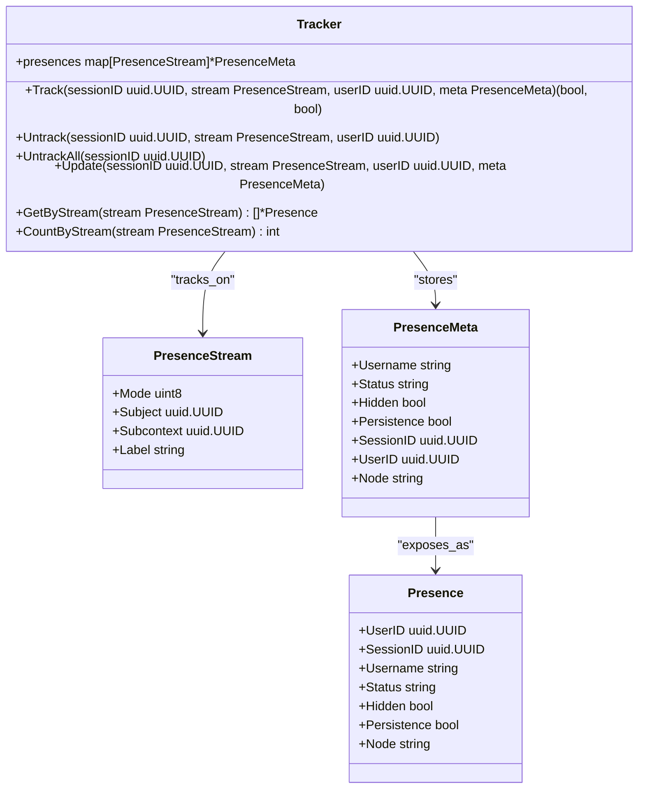
```mermaid
classDiagram
    class Tracker {
        +presences map[PresenceStream]*PresenceMeta
        +Track(sessionID uuid.UUID, stream PresenceStream, userID uuid.UUID, meta PresenceMeta) (bool, bool)
        +Untrack(sessionID uuid.UUID, stream PresenceStream, userID uuid.UUID)
        +UntrackAll(sessionID uuid.UUID)
        +Update(sessionID uuid.UUID, stream PresenceStream, userID uuid.UUID, meta PresenceMeta)
        +GetByStream(stream PresenceStream) []*Presence
        +CountByStream(stream PresenceStream) int
    }
    
    class PresenceStream {
        +Mode uint8
        +Subject uuid.UUID
        +Subcontext uuid.UUID
        +Label string
    }
    
    class PresenceMeta {
        +Username string
        +Status string
        +Hidden bool
        +Persistence bool
        +SessionID uuid.UUID
        +UserID uuid.UUID
        +Node string
    }
    
    class Presence {
        +UserID uuid.UUID
        +SessionID uuid.UUID
        +Username string
        +Status string
        +Hidden bool
        +Persistence bool
        +Node string
    }
    
    Tracker --> PresenceStream : "tracks_on"
    Tracker --> PresenceMeta : "stores"
    PresenceMeta --> Presence : "exposes_as"
```

### 2. Presence Events

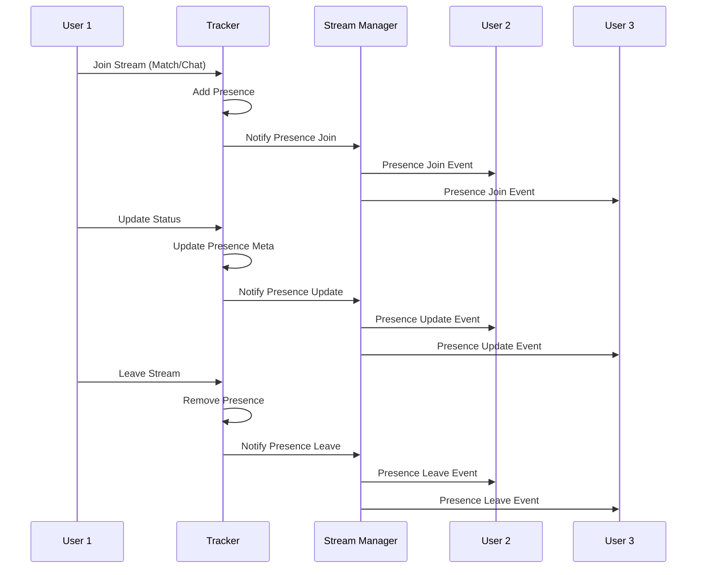
```mermaid
sequenceDiagram
    participant U1 as User 1
    participant T as Tracker
    participant SM as Stream Manager
    participant U2 as User 2
    participant U3 as User 3
    
    U1->>T: Join Stream (Match/Chat)
    T->>T: Add Presence
    T->>SM: Notify Presence Join
    SM->>U2: Presence Join Event
    SM->>U3: Presence Join Event
    
    U1->>T: Update Status
    T->>T: Update Presence Meta
    T->>SM: Notify Presence Update
    SM->>U2: Presence Update Event
    SM->>U3: Presence Update Event
    
    U1->>T: Leave Stream
    T->>T: Remove Presence
    T->>SM: Notify Presence Leave
    SM->>U2: Presence Leave Event
    SM->>U3: Presence Leave Event
```

## Match System Architecture

### 1. Match Lifecycle

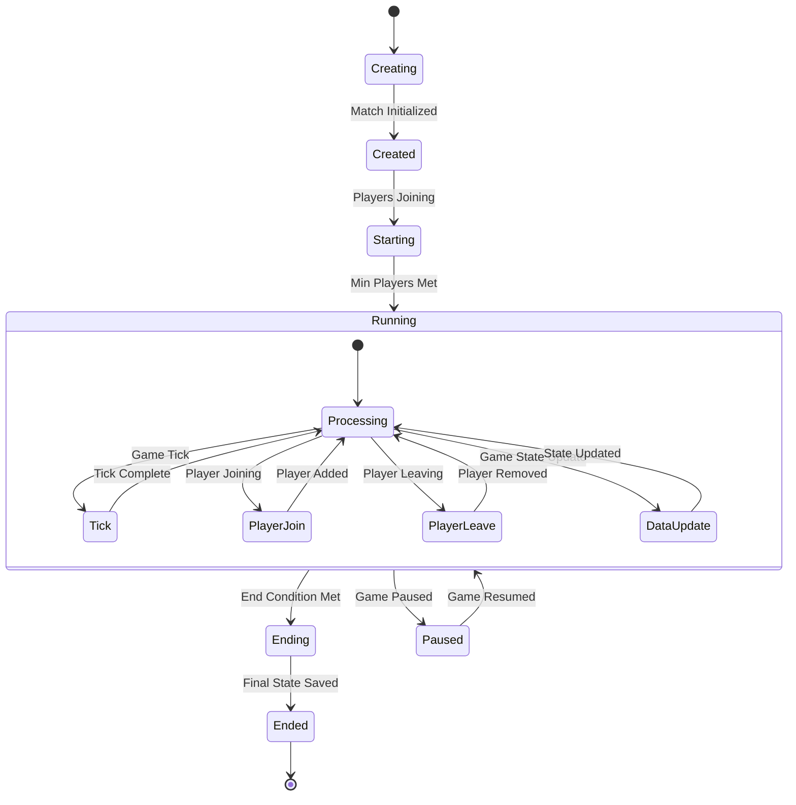
```mermaid
stateDiagram-v2
    [*] --> Creating
    Creating --> Created: Match Initialized
    Created --> Starting: Players Joining
    Starting --> Running: Min Players Met
    Running --> Ending: End Condition Met
    Running --> Paused: Game Paused
    Paused --> Running: Game Resumed
    Ending --> Ended: Final State Saved
    Ended --> [*]
    
    state Running {
        [*] --> Processing
        Processing --> Tick: Game Tick
        Tick --> Processing: Tick Complete
        Processing --> PlayerJoin: Player Joining
        PlayerJoin --> Processing: Player Added
        Processing --> PlayerLeave: Player Leaving
        PlayerLeave --> Processing: Player Removed
        Processing --> DataUpdate: Game State Update
        DataUpdate --> Processing: State Updated
    }
```

### 2. Match Registry

```mermaid
classDiagram
    class MatchRegistry {
        +matches map[string]*Match
        +CreateMatch(id string, core RuntimeMatchCore) (*Match, error)
        +GetMatch(id string) *Match
        +RemoveMatch(id string, stream PresenceStream)
        +JoinAttempt(id string, presences []*MatchPresence) (bool, bool, string)
        +Leave(id string, presences []*MatchPresence) error
        +SendData(id string, opCode int64, data []byte, presences []*MatchPresence) error
        +Signal(id string, data string) error
    }
    
    class Match {
        +ID string
        +Node string
        +IDComponents []string
        +Core RuntimeMatchCore
        +Handler RuntimeMatchHandler
        +CreateTime int64
        +Tick int64
        +Rate int64
        +Label string
        +Authoritative bool
        +presences map[uuid.UUID]*MatchPresence
    }
    
    class RuntimeMatchCore {
        +MatchInit(ctx context.Context, logger *zap.Logger, db *sql.DB, nk NakamaModule, params map[string]interface{}) (interface{}, int, string)
        +MatchJoinAttempt(ctx context.Context, logger *zap.Logger, db *sql.DB, nk NakamaModule, dispatcher MatchDispatcher, tick int64, state interface{}, presence *MatchPresence, metadata map[string]string) (interface{}, bool, string)
        +MatchJoin(ctx context.Context, logger *zap.Logger, db *sql.DB, nk NakamaModule, dispatcher MatchDispatcher, tick int64, state interface{}, presences []*MatchPresence) interface{}
        +MatchLeave(ctx context.Context, logger *zap.Logger, db *sql.DB, nk NakamaModule, dispatcher MatchDispatcher, tick int64, state interface{}, presences []*MatchPresence) interface{}
        +MatchLoop(ctx context.Context, logger *zap.Logger, db *sql.DB, nk NakamaModule, dispatcher MatchDispatcher, tick int64, state interface{}, messages []MatchData) interface{}
        +MatchTerminate(ctx context.Context, logger *zap.Logger, db *sql.DB, nk NakamaModule, dispatcher MatchDispatcher, tick int64, state interface{}, graceSeconds int) interface{}
        +MatchSignal(ctx context.Context, logger *zap.Logger, db *sql.DB, nk NakamaModule, dispatcher MatchDispatcher, tick int64, state interface{}, data string) (interface{}, string)
    }
    
    MatchRegistry --> Match : "manages"
    Match --> RuntimeMatchCore : "uses"
```

### 3. Match Communication Flow

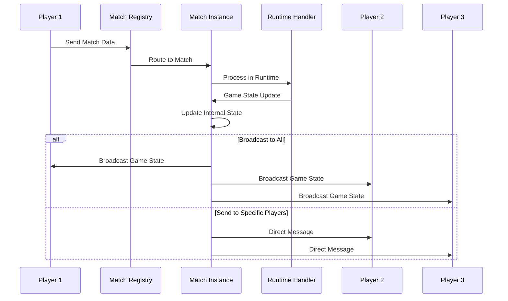
```mermaid
sequenceDiagram
    participant P1 as Player 1
    participant MR as Match Registry
    participant M as Match Instance
    participant RT as Runtime Handler
    participant P2 as Player 2
    participant P3 as Player 3
    
    P1->>MR: Send Match Data
    MR->>M: Route to Match
    M->>RT: Process in Runtime
    RT->>M: Game State Update
    M->>M: Update Internal State
    
    alt Broadcast to All
        M->>P1: Broadcast Game State
        M->>P2: Broadcast Game State
        M->>P3: Broadcast Game State
    else Send to Specific Players
        M->>P2: Direct Message
        M->>P3: Direct Message
    end
```

## Matchmaking System

### 1. Matchmaker Flow

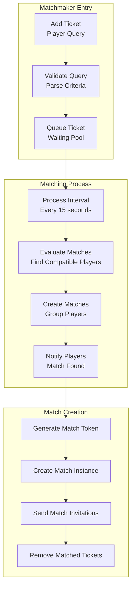
```mermaid
graph TB
    subgraph "Matchmaker Entry"
        AddTicket[Add Ticket<br/>Player Query]
        ValidateQuery[Validate Query<br/>Parse Criteria]
        QueueTicket[Queue Ticket<br/>Waiting Pool]
    end
    
    subgraph "Matching Process"
        ProcessInterval[Process Interval<br/>Every 15 seconds]
        EvaluateMatches[Evaluate Matches<br/>Find Compatible Players]
        CreateMatches[Create Matches<br/>Group Players]
        NotifyPlayers[Notify Players<br/>Match Found]
    end
    
    subgraph "Match Creation"
        GenerateToken[Generate Match Token]
        CreateMatchInstance[Create Match Instance]
        SendInvitations[Send Match Invitations]
        RemoveTickets[Remove Matched Tickets]
    end
    
    AddTicket --> ValidateQuery
    ValidateQuery --> QueueTicket
    QueueTicket --> ProcessInterval
    ProcessInterval --> EvaluateMatches
    EvaluateMatches --> CreateMatches
    CreateMatches --> NotifyPlayers
    NotifyPlayers --> GenerateToken
    GenerateToken --> CreateMatchInstance
    CreateMatchInstance --> SendInvitations
    SendInvitations --> RemoveTickets
```

### 2. Matchmaking Algorithm

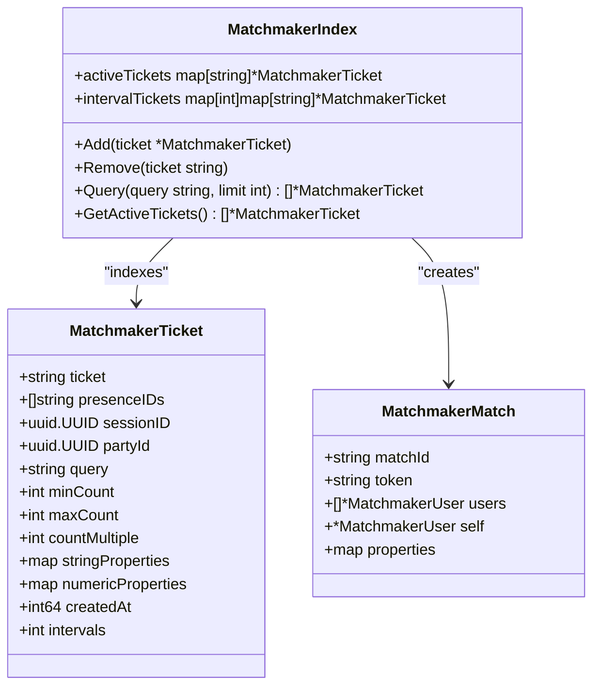
```mermaid
classDiagram
    class MatchmakerTicket {
        +string ticket
        +[]string presenceIDs
        +uuid.UUID sessionID
        +uuid.UUID partyId
        +string query
        +int minCount
        +int maxCount
        +int countMultiple
        +map stringProperties
        +map numericProperties
        +int64 createdAt
        +int intervals
    }
    
    class MatchmakerIndex {
        +activeTickets map[string]*MatchmakerTicket
        +intervalTickets map[int]map[string]*MatchmakerTicket
        +Add(ticket *MatchmakerTicket)
        +Remove(ticket string)
        +Query(query string, limit int) []*MatchmakerTicket
        +GetActiveTickets() []*MatchmakerTicket
    }
    
    class MatchmakerMatch {
        +string matchId
        +string token
        +[]*MatchmakerUser users
        +*MatchmakerUser self
        +map properties
    }
    
    MatchmakerIndex --> MatchmakerTicket : "indexes"
    MatchmakerIndex --> MatchmakerMatch : "creates"
```

## Chat System

### 1. Channel Types

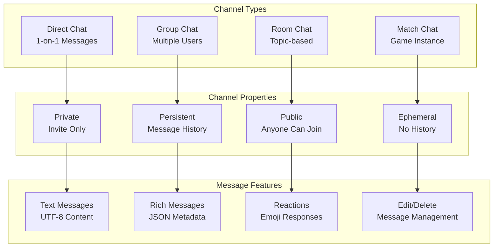
```mermaid
graph TB
    subgraph "Channel Types"
        DirectChat[Direct Chat<br/>1-on-1 Messages]
        GroupChat[Group Chat<br/>Multiple Users]
        RoomChat[Room Chat<br/>Topic-based]
        MatchChat[Match Chat<br/>Game Instance]
    end
    
    subgraph "Channel Properties"
        Persistent[Persistent<br/>Message History]
        Ephemeral[Ephemeral<br/>No History]
        Public[Public<br/>Anyone Can Join]
        Private[Private<br/>Invite Only]
    end
    
    subgraph "Message Features"
        TextMessage[Text Messages<br/>UTF-8 Content]
        RichMessage[Rich Messages<br/>JSON Metadata]
        MessageReaction[Reactions<br/>Emoji Responses]
        MessageEdit[Edit/Delete<br/>Message Management]
    end
    
    DirectChat --> Private
    GroupChat --> Persistent
    RoomChat --> Public
    MatchChat --> Ephemeral
    
    Private --> TextMessage
    Persistent --> RichMessage
    Public --> MessageReaction
    Ephemeral --> MessageEdit
```

### 2. Chat Message Flow

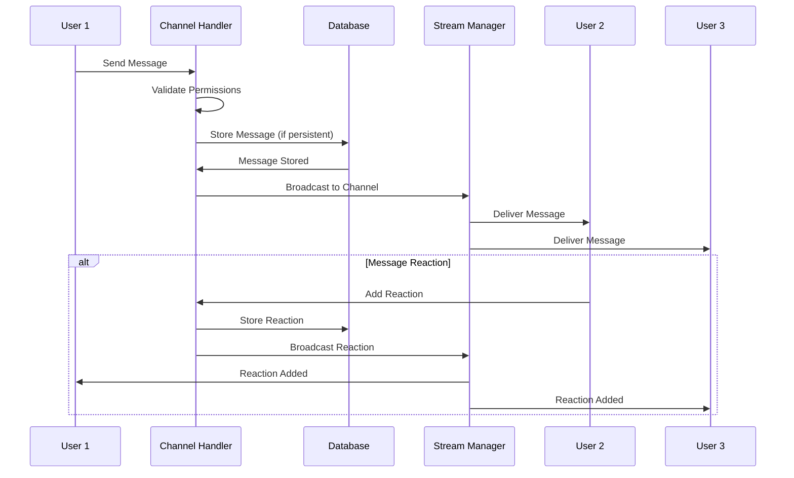
```mermaid
sequenceDiagram
    participant U1 as User 1
    participant CH as Channel Handler
    participant DB as Database
    participant SM as Stream Manager
    participant U2 as User 2
    participant U3 as User 3
    
    U1->>CH: Send Message
    CH->>CH: Validate Permissions
    CH->>DB: Store Message (if persistent)
    DB->>CH: Message Stored
    CH->>SM: Broadcast to Channel
    SM->>U2: Deliver Message
    SM->>U3: Deliver Message
    
    alt Message Reaction
        U2->>CH: Add Reaction
        CH->>DB: Store Reaction
        CH->>SM: Broadcast Reaction
        SM->>U1: Reaction Added
        SM->>U3: Reaction Added
    end
```

## Party System

### 1. Party Management

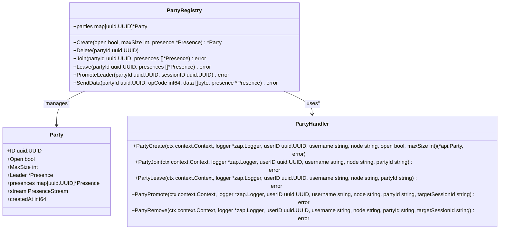
```mermaid
classDiagram
    class PartyRegistry {
        +parties map[uuid.UUID]*Party
        +Create(open bool, maxSize int, presence *Presence) *Party
        +Delete(partyId uuid.UUID)
        +Join(partyId uuid.UUID, presences []*Presence) error
        +Leave(partyId uuid.UUID, presences []*Presence) error
        +PromoteLeader(partyId uuid.UUID, sessionID uuid.UUID) error
        +SendData(partyId uuid.UUID, opCode int64, data []byte, presence *Presence) error
    }
    
    class Party {
        +ID uuid.UUID
        +Open bool
        +MaxSize int
        +Leader *Presence
        +presences map[uuid.UUID]*Presence
        +stream PresenceStream
        +createdAt int64
    }
    
    class PartyHandler {
        +PartyCreate(ctx context.Context, logger *zap.Logger, userID uuid.UUID, username string, node string, open bool, maxSize int) (*api.Party, error)
        +PartyJoin(ctx context.Context, logger *zap.Logger, userID uuid.UUID, username string, node string, partyId string) error
        +PartyLeave(ctx context.Context, logger *zap.Logger, userID uuid.UUID, username string, node string, partyId string) error
        +PartyPromote(ctx context.Context, logger *zap.Logger, userID uuid.UUID, username string, node string, partyId string, targetSessionId string) error
        +PartyRemove(ctx context.Context, logger *zap.Logger, userID uuid.UUID, username string, node string, partyId string, targetSessionId string) error
    }
    
    PartyRegistry --> Party : "manages"
    PartyRegistry --> PartyHandler : "uses"
```

### 2. Party Workflow

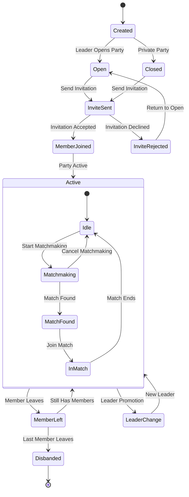
```mermaid
stateDiagram-v2
    [*] --> Created
    Created --> Open: Leader Opens Party
    Created --> Closed: Private Party
    Open --> InviteSent: Send Invitation
    Closed --> InviteSent: Send Invitation
    InviteSent --> MemberJoined: Invitation Accepted
    InviteSent --> InviteRejected: Invitation Declined
    InviteRejected --> Open: Return to Open
    MemberJoined --> Active: Party Active
    Active --> MemberLeft: Member Leaves
    MemberLeft --> Active: Still Has Members
    MemberLeft --> Disbanded: Last Member Leaves
    Active --> LeaderChange: Leader Promotion
    LeaderChange --> Active: New Leader
    Disbanded --> [*]
    
    state Active {
        [*] --> Idle
        Idle --> Matchmaking: Start Matchmaking
        Matchmaking --> MatchFound: Match Found
        MatchFound --> InMatch: Join Match
        InMatch --> Idle: Match Ends
        Matchmaking --> Idle: Cancel Matchmaking
    }
```

## Status and Notifications

### 1. Status Updates

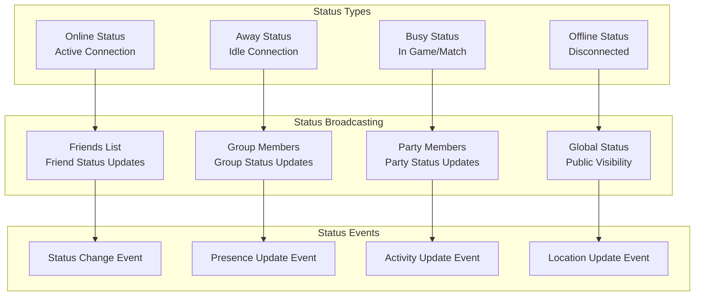
```mermaid
graph TB
    subgraph "Status Types"
        Online[Online Status<br/>Active Connection]
        Away[Away Status<br/>Idle Connection]
        Busy[Busy Status<br/>In Game/Match]
        Offline[Offline Status<br/>Disconnected]
    end
    
    subgraph "Status Broadcasting"
        Friends[Friends List<br/>Friend Status Updates]
        Groups[Group Members<br/>Group Status Updates]
        Parties[Party Members<br/>Party Status Updates]
        Global[Global Status<br/>Public Visibility]
    end
    
    subgraph "Status Events"
        StatusChange[Status Change Event]
        PresenceUpdate[Presence Update Event]
        ActivityUpdate[Activity Update Event]
        LocationUpdate[Location Update Event]
    end
    
    Online --> Friends
    Away --> Groups
    Busy --> Parties
    Offline --> Global
    
    Friends --> StatusChange
    Groups --> PresenceUpdate
    Parties --> ActivityUpdate
    Global --> LocationUpdate
```

### 2. Push Notifications

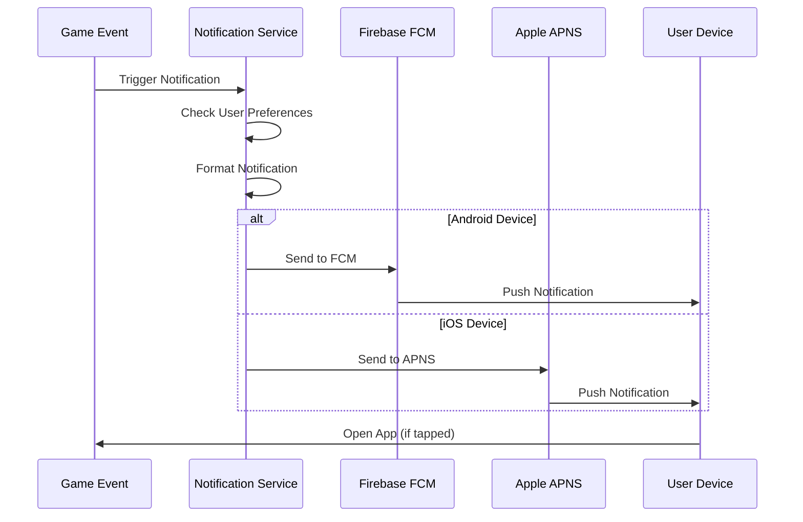
```mermaid
sequenceDiagram
    participant Game as Game Event
    participant NS as Notification Service
    participant FCM as Firebase FCM
    participant APNS as Apple APNS
    participant Device as User Device
    
    Game->>NS: Trigger Notification
    NS->>NS: Check User Preferences
    NS->>NS: Format Notification
    
    alt Android Device
        NS->>FCM: Send to FCM
        FCM->>Device: Push Notification
    else iOS Device
        NS->>APNS: Send to APNS
        APNS->>Device: Push Notification
    end
    
    Device->>Game: Open App (if tapped)
```

## Performance Optimization

### 1. Connection Scaling

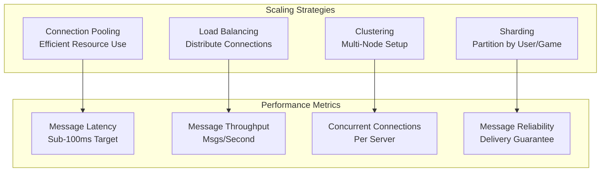
```mermaid
graph TB
    subgraph "Scaling Strategies"
        ConnPool[Connection Pooling<br/>Efficient Resource Use]
        LoadBalance[Load Balancing<br/>Distribute Connections]
        Clustering[Clustering<br/>Multi-Node Setup]
        Sharding[Sharding<br/>Partition by User/Game]
    end
    
    subgraph "Performance Metrics"
        Latency[Message Latency<br/>Sub-100ms Target]
        Throughput[Message Throughput<br/>Msgs/Second]
        Concurrent[Concurrent Connections<br/>Per Server]
        Reliability[Message Reliability<br/>Delivery Guarantee]
    end
    
    ConnPool --> Latency
    LoadBalance --> Throughput
    Clustering --> Concurrent
    Sharding --> Reliability
```

### 2. Message Optimization

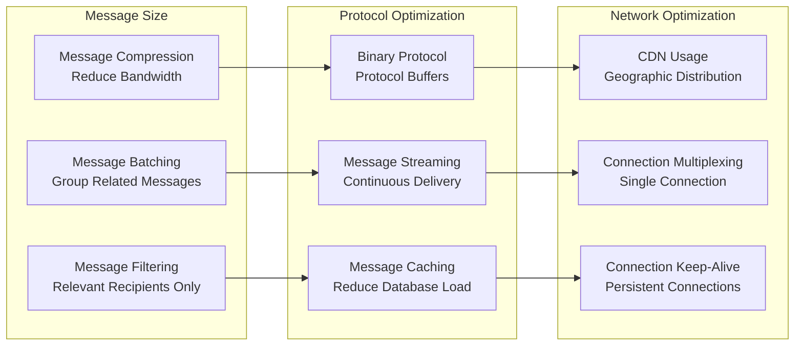
```mermaid
graph LR
    subgraph "Message Size"
        Compression[Message Compression<br/>Reduce Bandwidth]
        Batching[Message Batching<br/>Group Related Messages]
        Filtering[Message Filtering<br/>Relevant Recipients Only]
    end
    
    subgraph "Protocol Optimization"
        Binary[Binary Protocol<br/>Protocol Buffers]
        Streaming[Message Streaming<br/>Continuous Delivery]
        Caching[Message Caching<br/>Reduce Database Load]
    end
    
    subgraph "Network Optimization"
        CDN[CDN Usage<br/>Geographic Distribution]
        Multiplexing[Connection Multiplexing<br/>Single Connection]
        KeepAlive[Connection Keep-Alive<br/>Persistent Connections]
    end
    
    Compression --> Binary
    Batching --> Streaming
    Filtering --> Caching
    
    Binary --> CDN
    Streaming --> Multiplexing
    Caching --> KeepAlive
```

## Monitoring and Diagnostics

### 1. Real-time Metrics

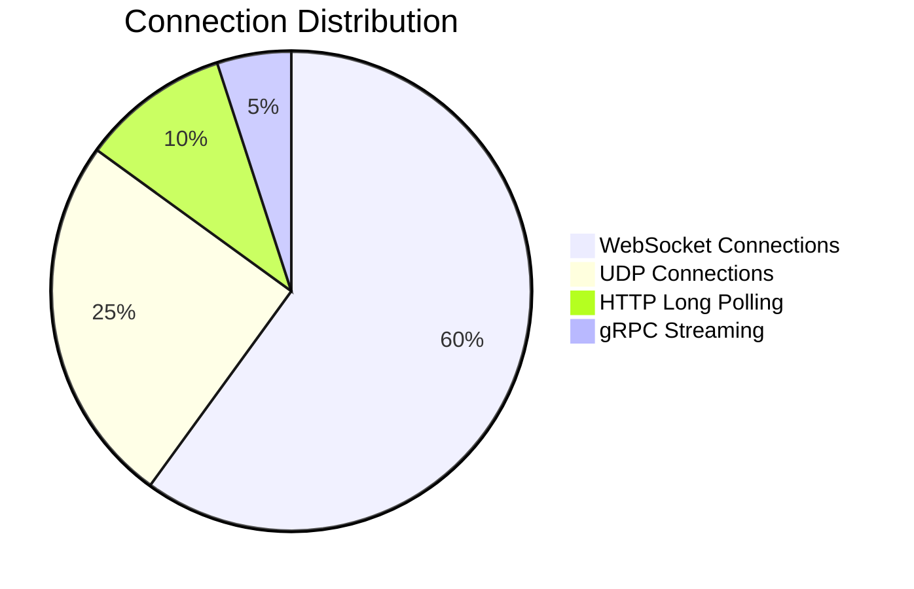
```mermaid
pie title Connection Distribution
    "WebSocket Connections" : 60
    "UDP Connections" : 25
    "HTTP Long Polling" : 10
    "gRPC Streaming" : 5
```

### 2. Performance Monitoring

```mermaid
graph TB
    subgraph "Connection Metrics"
        ActiveConn[Active Connections<br/>Current Count]
        ConnRate[Connection Rate<br/>Connections/Second]
        ConnLatency[Connection Latency<br/>Handshake Time]
        ConnErrors[Connection Errors<br/>Failed Connections]
    end
    
    subgraph "Message Metrics"
        MsgThroughput[Message Throughput<br/>Messages/Second]
        MsgLatency[Message Latency<br/>End-to-End Time]
        MsgSize[Message Size<br/>Average Bytes]
        MsgErrors[Message Errors<br/>Failed Deliveries]
    end
    
    subgraph "System Metrics"
        CPUUsage[CPU Usage<br/>Processing Load]
        MemoryUsage[Memory Usage<br/>Connection Overhead]
        NetworkIO[Network I/O<br/>Bandwidth Usage]
        GoroutineCount[Goroutine Count<br/>Concurrency Level]
    end
```

For more information on related topics:
- [Component Architecture](components.md) - Real-time component details
- [API Architecture](api.md) - WebSocket API specifications  
- [Deployment Architecture](deployment.md) - Scaling real-time systems