# Runtime Extensions Architecture

This document details Nakama's runtime extension system, including Go, Lua, and JavaScript runtime environments, custom logic execution, and extensibility patterns.

## Runtime System Overview

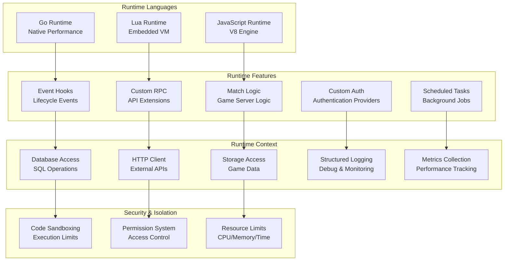

## Go Runtime Architecture

### 1. Go Plugin System

```mermaid
classDiagram
    class RuntimeProvider {
        +NewRuntimeGoContext() RuntimeGoContext
        +NewRuntimeGoLogger() RuntimeGoLogger
        +NewRuntimeGoNakamaModule() RuntimeGoNakamaModule
        +ProcessMatchmakingMatch() interface{}
        +ProcessTournamentEnd() interface{}
        +ProcessTournamentReset() interface{}
        +ProcessLeaderboardEnd() interface{}
        +ProcessLeaderboardReset() interface{}
    }
    
    class RuntimeGoContext {
        +Ctx context.Context
        +Logger *zap.Logger
        +DB *sql.DB
        +UserID uuid.UUID
        +Username string
        +Vars map[string]string
        +UserSessionExp int64
        +SessionID uuid.UUID
        +ClientIP string
        +ClientPort string
        +Lang string
    }
    
    class RuntimeGoNakamaModule {
        +AuthenticateApple() (*api.Session, error)
        +AuthenticateCustom() (*api.Session, error)
        +AuthenticateDevice() (*api.Session, error)
        +AuthenticateEmail() (*api.Session, error)
        +AuthenticateFacebook() (*api.Session, error)
        +AuthenticateGameCenter() (*api.Session, error)
        +AuthenticateGoogle() (*api.Session, error)
        +AuthenticateStream() (*api.Session, error)
        +StorageRead() ([]*api.StorageObject, error)
        +StorageWrite() ([]*api.StorageObjectAck, error)
        +StorageDelete() error
        +StorageList() ([]*api.StorageObjectList, error)
    }
    
    RuntimeProvider --> RuntimeGoContext : "creates"
    RuntimeProvider --> RuntimeGoNakamaModule : "provides"
```

### 2. Go Runtime Hooks

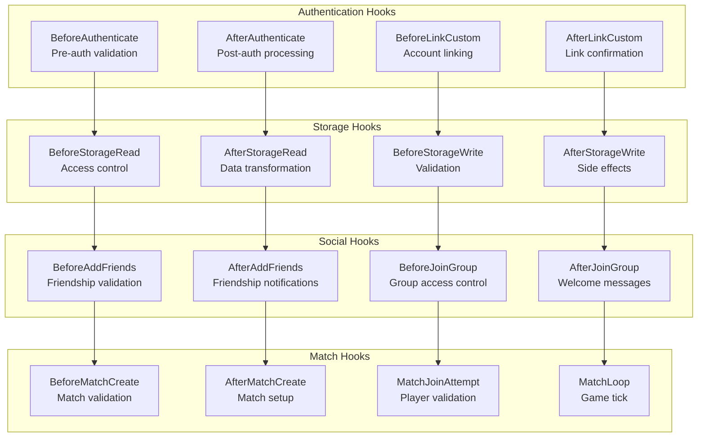

### 3. Go Runtime Execution Flow

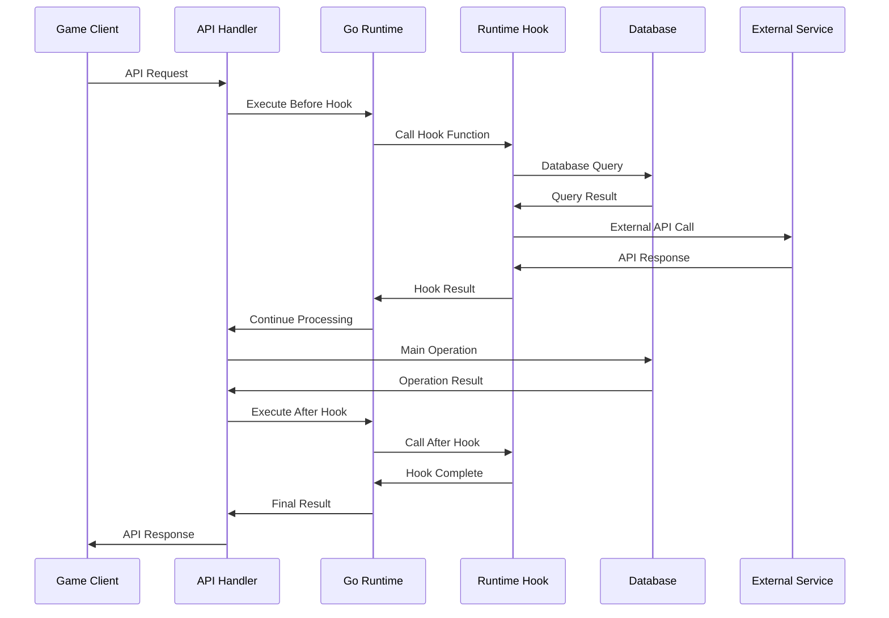

## Lua Runtime Architecture

### 1. Lua Virtual Machine

```mermaid
classDiagram
    class LuaRuntime {
        +vm *lua.LState
        +modules map[string]lua.LGFunction
        +InitModule() error
        +LoadModule() error
        +Call() (lua.LValue, error)
        +ExecuteHook() (interface{}, error)
        +InvokeFunction() (interface{}, error)
    }
    
    class LuaState {
        +*lua.LState
        +userdata map[string]interface{}
        +Get(key string) lua.LValue
        +Set(key string, value lua.LValue)
        +CallByParam(params lua.P) error
        +GetGlobal(name string) lua.LValue
        +SetGlobal(name string, value lua.LValue)
    }
    
    class NakamaModule {
        +authenticate_apple() userdata
        +authenticate_custom() userdata
        +authenticate_device() userdata
        +storage_read() table
        +storage_write() table
        +storage_delete() nil
        +http_request() table
        +json_encode() string
        +json_decode() table
        +logger_info() nil
        +logger_error() nil
    }
    
    LuaRuntime --> LuaState : "manages"
    LuaRuntime --> NakamaModule : "provides"
```

### 2. Lua Module System

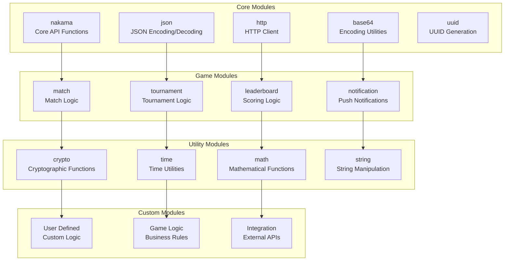

### 3. Lua Execution Context

```lua
-- Example Lua hook implementation
local nk = require("nakama")

function authenticate_custom(context, payload)
    -- Access context information
    local user_id = context.user_id
    local username = context.username
    local vars = context.vars or {}
    
    -- Custom authentication logic
    local custom_id = payload.account.id
    if not custom_id or #custom_id < 6 then
        error("Custom ID must be at least 6 characters")
    end
    
    -- External validation
    local http_headers = {
        ["Content-Type"] = "application/json",
        ["Authorization"] = "Bearer " .. vars.api_token
    }
    
    local http_body = nk.json_encode({
        custom_id = custom_id,
        timestamp = os.time()
    })
    
    local result = nk.http_request("https://auth.example.com/validate", 
                                   "POST", http_headers, http_body)
    
    if result.code ~= 200 then
        error("External authentication failed")
    end
    
    -- Return success with custom properties
    return {
        success = true,
        user_id = user_id,
        properties = {
            external_validated = true,
            validation_time = os.time()
        }
    }
end
```

## JavaScript Runtime Architecture

### 1. V8 JavaScript Engine

```mermaid
classDiagram
    class JSRuntime {
        +vm *goja.Runtime
        +modules map[string]interface{}
        +InitializeVM() error
        +LoadScript() error
        +ExecuteFunction() (interface{}, error)
        +SetGlobal() error
        +GetGlobal() interface{}
    }
    
    class JSContext {
        +ctx context.Context
        +logger Logger
        +db Database
        +nk NakamaModule
        +userID string
        +username string
        +vars map[string]interface{}
        +sessionExp number
        +sessionID string
        +clientIP string
        +clientPort string
    }
    
    class NakamaJS {
        +authenticateApple() Promise
        +authenticateCustom() Promise
        +authenticateDevice() Promise
        +storageRead() Promise
        +storageWrite() Promise
        +storageDelete() Promise
        +httpRequest() Promise
        +logger Object
        +sqlExec() Promise
        +sqlQuery() Promise
    }
    
    JSRuntime --> JSContext : "provides"
    JSRuntime --> NakamaJS : "exposes"
```

### 2. JavaScript Module Loading

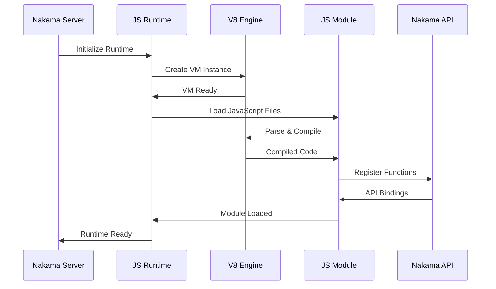

### 3. JavaScript Hook Example

```javascript
// Example JavaScript hook implementation
function beforeStorageWrite(ctx, logger, nk, payload) {
    // Access context
    const userId = ctx.userId;
    const username = ctx.username;
    const vars = ctx.vars || {};
    
    // Validate storage objects
    payload.objects.forEach(obj => {
        // Validate collection permissions
        if (obj.collection === 'private' && obj.userId !== userId) {
            throw new Error('Cannot write to private collection of another user');
        }
        
        // Validate data size
        if (obj.value.length > 1024 * 1024) { // 1MB limit
            throw new Error('Storage object too large');
        }
        
        // Parse and validate JSON content
        try {
            const data = JSON.parse(obj.value);
            if (!data.version || data.version < 1) {
                throw new Error('Invalid data version');
            }
        } catch (e) {
            throw new Error('Invalid JSON in storage object');
        }
    });
    
    // Log the operation
    logger.info('Storage write validated', {
        userId: userId,
        objectCount: payload.objects.length
    });
    
    return payload;
}

// Example custom RPC function
function customMatchLogic(ctx, logger, nk, payload) {
    const userId = ctx.userId;
    const matchId = payload.match_id;
    
    // Get match state
    const match = nk.matchGet(matchId);
    if (!match) {
        throw new Error('Match not found');
    }
    
    // Custom business logic
    const playerAction = JSON.parse(payload.action);
    const gameState = JSON.parse(match.state);
    
    // Validate player action
    if (!isValidAction(playerAction, gameState, userId)) {
        throw new Error('Invalid action for current game state');
    }
    
    // Update game state
    const newState = processAction(gameState, playerAction, userId);
    
    // Send to match
    nk.matchSignal(matchId, JSON.stringify({
        type: 'state_update',
        state: newState,
        player: userId
    }));
    
    return {
        success: true,
        newState: newState
    };
}

function isValidAction(action, state, userId) {
    // Implement game-specific validation logic
    return true;
}

function processAction(state, action, userId) {
    // Implement game-specific state update logic
    return state;
}
```

## Runtime Event System

### 1. Event Lifecycle

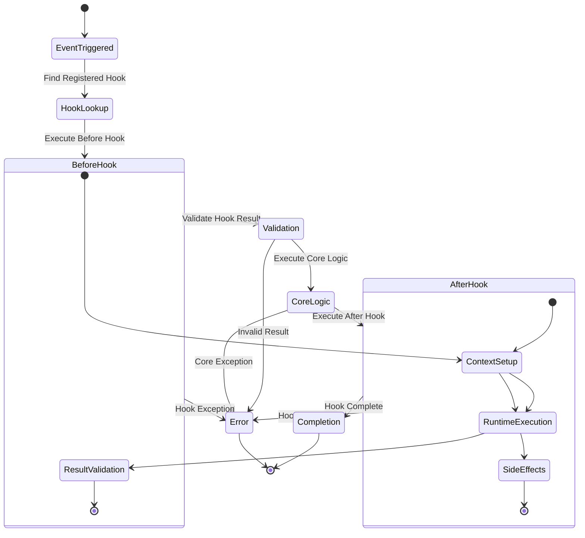

### 2. Hook Registration System

```mermaid
classDiagram
    class RuntimeInfo {
        +string name
        +RuntimeType type
        +map[string]RuntimeHook hooks
        +map[string]RuntimeRPC rpcs
        +map[string]RuntimeMatch matches
        +*RuntimeConfig config
    }
    
    class RuntimeHook {
        +string name
        +HookType type
        +interface{} handler
        +bool enabled
        +map[string]interface{} config
    }
    
    class RuntimeRPC {
        +string id
        +interface{} handler
        +HTTPMethod method
        +string path
        +bool authenticated
    }
    
    class RuntimeMatch {
        +string name
        +interface{} core
        +map[string]interface{} config
        +bool authoritative
    }
    
    class HookType {
        +BEFORE_AUTHENTICATE = "before_authenticate"
        +AFTER_AUTHENTICATE = "after_authenticate"
        +BEFORE_STORAGE_READ = "before_storage_read"
        +AFTER_STORAGE_WRITE = "after_storage_write"
        +MATCH_INIT = "match_init"
        +MATCH_JOIN_ATTEMPT = "match_join_attempt"
        +RPC = "rpc"
    }
    
    RuntimeInfo --> RuntimeHook : "contains"
    RuntimeInfo --> RuntimeRPC : "contains"
    RuntimeInfo --> RuntimeMatch : "contains"
    RuntimeHook --> HookType : "categorized_by"
```

## Custom RPC System

### 1. RPC Registration and Routing

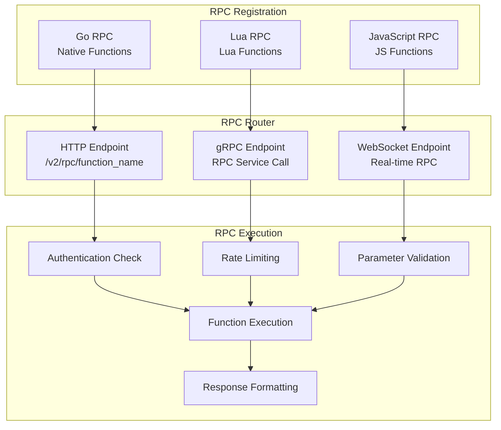

### 2. RPC Security Model

```mermaid
classDiagram
    class RPCConfig {
        +bool authenticated
        +[]string allowedUsers
        +[]string allowedRoles
        +map[string]interface{} rateLimit
        +map[string]interface{} permissions
        +bool httpEnabled
        +bool grpcEnabled
        +bool wsEnabled
    }
    
    class RPCContext {
        +string userID
        +string sessionID
        +string username
        +map[string]string vars
        +string clientIP
        +string clientPort
        +string userAgent
        +map[string]interface{} permissions
    }
    
    class RPCValidator {
        +ValidateAuth(ctx RPCContext, config RPCConfig) error
        +ValidateRateLimit(ctx RPCContext, config RPCConfig) error
        +ValidatePermissions(ctx RPCContext, config RPCConfig) error
        +ValidateInput(payload interface{}) error
    }
    
    RPCConfig --> RPCContext : "applied_to"
    RPCValidator --> RPCConfig : "validates"
    RPCValidator --> RPCContext : "checks"
```

## Match Runtime System

### 1. Authoritative Server Architecture

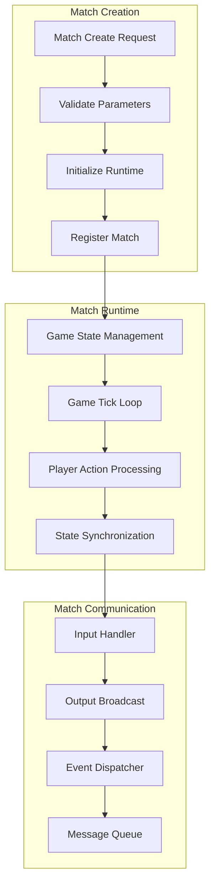

### 2. Match Lifecycle Hooks

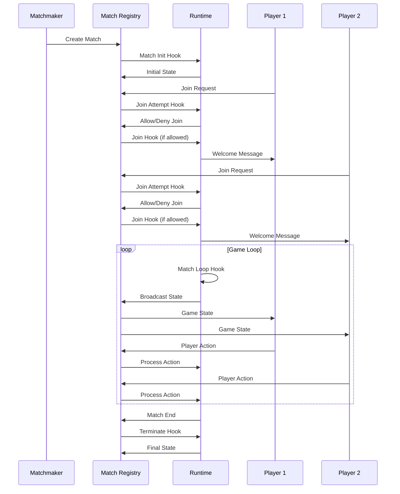

## Performance and Resource Management

### 1. Resource Limits

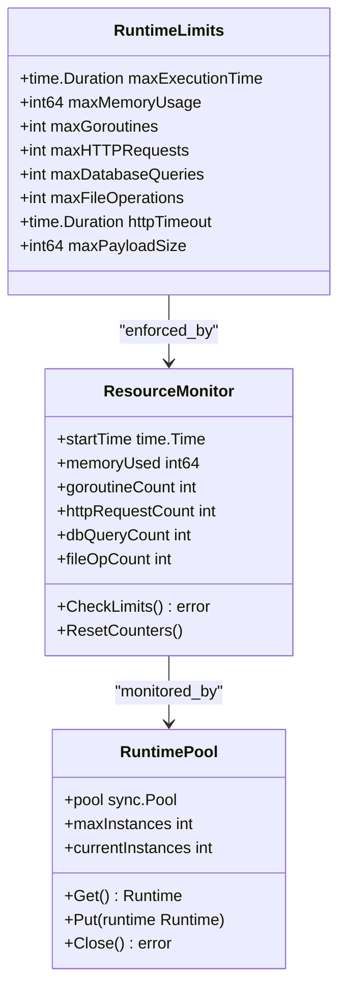

### 2. Performance Optimization

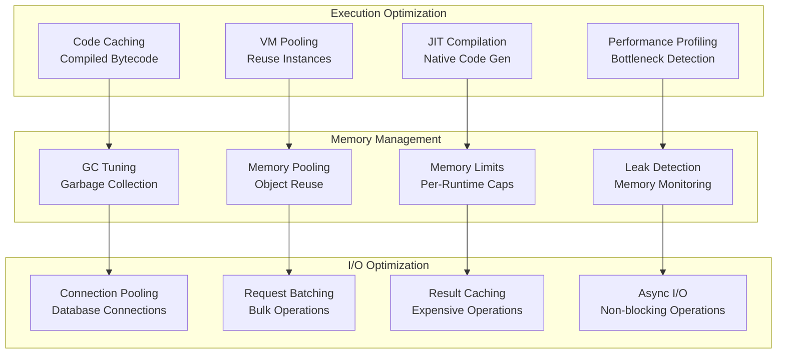

## Development and Debugging

### 1. Runtime Development Workflow

```mermaid
graph LR
    subgraph "Development"
        WriteCode[Write Runtime Code<br/>Go/Lua/JS]
        LocalTest[Local Testing<br/>Development Server]
        UnitTest[Unit Testing<br/>Function Tests]
        Integration[Integration Testing<br/>End-to-end Tests]
    end
    
    subgraph "Deployment"
        Package[Package Code<br/>Bundle Files]
        Upload[Upload to Server<br/>Hot Reload]
        Validate[Validate Deployment<br/>Health Checks]
        Monitor[Monitor Performance<br/>Runtime Metrics]
    end
    
    subgraph "Debugging"
        Logging[Runtime Logging<br/>Debug Output]
        ErrorTracking[Error Tracking<br/>Exception Handling]
        Profiling[Performance Profiling<br/>CPU/Memory Usage]
        Tracing[Request Tracing<br/>Execution Flow]
    end
    
    WriteCode --> LocalTest
    LocalTest --> UnitTest
    UnitTest --> Integration
    Integration --> Package
    
    Package --> Upload
    Upload --> Validate
    Validate --> Monitor
    Monitor --> Logging
    
    Logging --> ErrorTracking
    ErrorTracking --> Profiling
    Profiling --> Tracing
```

### 2. Error Handling and Recovery

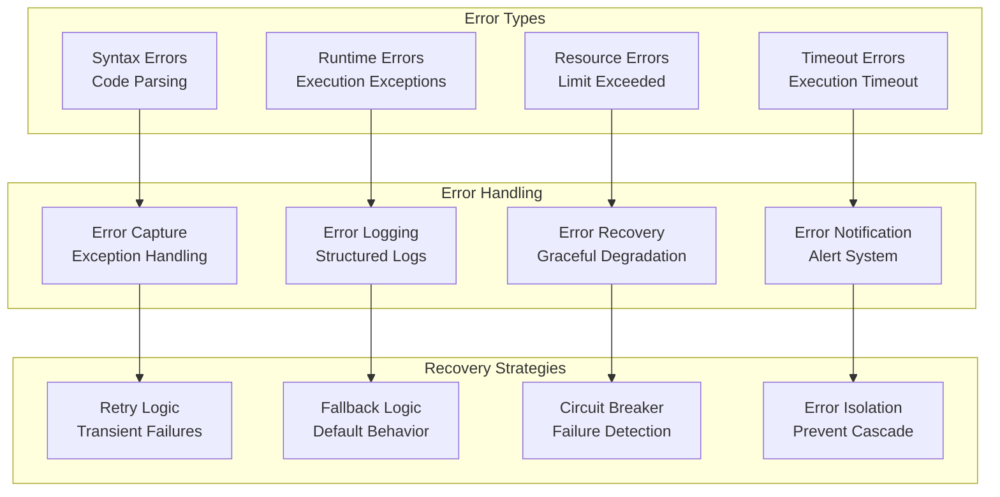

For more information on related topics:
- [Component Architecture](components.md) - Runtime component integration
- [Authentication & Authorization](auth.md) - Runtime security context
- [API Architecture](api.md) - Custom RPC endpoint design